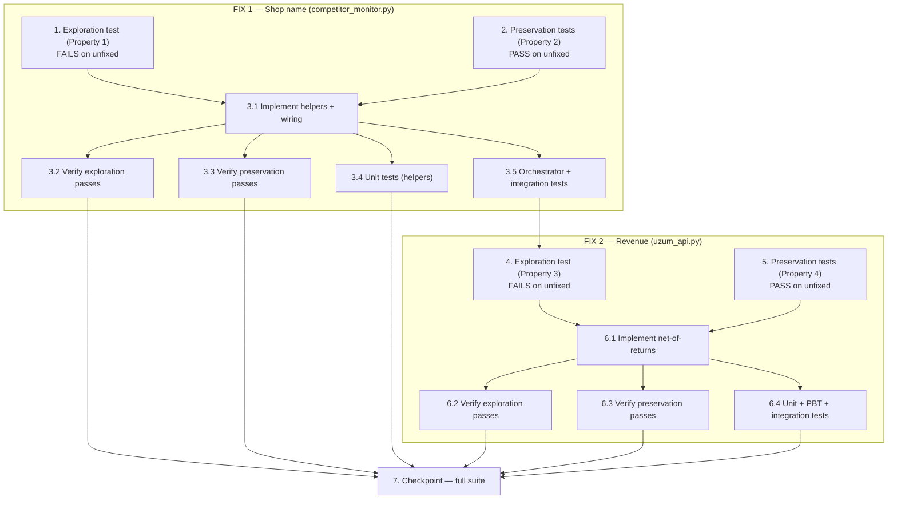

# Implementation Plan

This plan fixes two independent defects in the **Uzumchi** project only
(`services/competitor_monitor.py` and `services/uzum_api.py`). The
`uzum_seller_bot` project is a read-only reference and MUST NOT be touched.

The work is ordered by dependency: **FIX 1 (shop name)** is implemented and
validated first, then **FIX 2 (revenue)**. Exploration tests (which MUST FAIL
on unfixed code) and preservation tests (which MUST PASS on unfixed code) are
written BEFORE each fix. All new tests live under `Uzumchi/tests/` and follow
the existing pytest conventions (`tests/test_competitor_price.py`,
`tests/test_finance.py`). **Do NOT implement any fix before its exploration and
preservation tests are written and run on the UNFIXED code.**

---

## FIX 1 — Robust competitor shop/seller name (`services/competitor_monitor.py`)

- [x] 1. Write bug-condition exploration test for shop-name resolution
  - **Property 1: Bug Condition** - Robust Shop-Name Resolution
  - **CRITICAL**: This test MUST FAIL on unfixed code — failure confirms the bug exists.
  - **DO NOT attempt to fix the test or the code when it fails.**
  - **NOTE**: This test encodes the expected behavior — it will validate the fix when it passes after implementation.
  - **GOAL**: Surface counterexamples that demonstrate the competitor shop name renders as `🏪 —` despite a resolvable name.
  - **Scoped PBT Approach**: For deterministic shapes, scope the property to the concrete failing cases from the design `Examples` section.
  - Add a test file (e.g. `Uzumchi/tests/test_competitor_shop_name.py`) covering, per the design Bug Condition (`isBugCondition_shop`) and `Examples`:
    - API payload `{"seller": {"title": "ACME"}}` → expected resolved shop `"ACME"` (UNFIXED yields `"—"`).
    - API failed, HTML contains `"seller":{"title":"HtmlShop"}` → expected `"HtmlShop"` (UNFIXED hardcodes `"—"`).
    - API failed, HTML JSON-LD `"brand":{"name":"BrandX"}` → expected `"BrandX"` (UNFIXED yields `"—"`).
  - Run on UNFIXED code in `Uzumchi/`.
  - **EXPECTED OUTCOME**: Test FAILS (this is correct — it proves the bug exists).
  - Document counterexamples found (e.g. `get_product_info_by_url` returns `info["shop"] == "—"` while the name is present in payload/HTML).
  - Mark complete when the test is written, run, and the failure is documented.
  - _Files: services/competitor_monitor.py (`get_product_info_by_url`, `_get_product_from_api`), tests/test_competitor_shop_name.py_
  - _Requirements: 1.1, 1.2_

- [x] 2. Write preservation property tests for shop-name (BEFORE implementing FIX 1)
  - **Property 2: Preservation** - Genuinely-Missing Names, Prices, Proxy, Manual Fallback
  - **IMPORTANT**: Follow the observation-first methodology — run UNFIXED code first, record outputs, then encode them.
  - Observe on UNFIXED code and capture, per the design Preservation Requirements:
    - Genuinely-missing name: payload `{"shop": {}}` / no markers and HTML with no seller markers → `info["shop"] == "—"`.
    - Prices / proxy / manual fallback: representative inputs leave `min`/`max`/`price`, `price_source`, `html_only` and the manual-fallback path byte-for-byte unchanged.
  - Write property-based tests (Hypothesis is already in the repo — see `.hypothesis/`) generating payloads/HTML with all shop-name candidates empty → assert `_extract_shop_name`/resolution yields `"—"` and other `info` fields are unchanged.
  - Run tests on UNFIXED code in `Uzumchi/`.
  - **EXPECTED OUTCOME**: Tests PASS (this confirms the baseline behavior to preserve).
  - Mark complete when the tests are written, run, and passing on unfixed code.
  - _Files: services/competitor_monitor.py (`get_product_info_by_url`), tests/test_competitor_shop_name.py_
  - _Requirements: 3.1, 3.2, 3.4_

- [x] 3. Implement FIX 1 — robust shop/seller name resolution

  - [x] 3.1 Add the two pure helpers and wire them in
    - Add `_extract_shop_name(payload: dict) -> str` to `services/competitor_monitor.py`: priority-ordered, multi-field, nested-safe; returns the first non-empty stripped string across the candidate fields listed in the design (Fix Implementation 1a: `seller.title` → `seller.name` → `seller.shopName` → `seller.companyName` → `shopTitle` → `shopName` → `shopInfo.title` → `shopInfo.name` → `sellerName` → `shop.title`/`name`/`shopName` → top-level `sellerTitle`/`companyName`), else `""`. Guard non-dict parents; handle bare-string `shop`/`seller`.
    - Add `get_shop_from_html(html: str) -> str | None` to `services/competitor_monitor.py`: parse embedded JSON keys (`"sellerTitle"`, `"shopTitle"`, `"sellerName"`), `"seller":{...}` and `"shopInfo":{...}` objects (`title` then `name`), and JSON-LD `brand`/`seller` name (reusing the regex/JSON-LD style of `get_price_from_html`); returns first non-empty match, else `None`.
    - Wire into `get_product_info_by_url`: reuse the already-fetched `html` (do NOT add another fetch); when API shop is empty/`"—"` fall back to `get_shop_from_html(html)`; on the API-failed HTML-primary branch replace the hardcoded `"shop": "—"` with `get_shop_from_html(html)` when available, else `"—"`.
    - Replace the narrow extraction in `_get_product_from_api` with `shop_name = _extract_shop_name(payload) or "—"`; keep the returned dict shape unchanged.
    - Keep `check_saved_urls` and `format_single_product_report` signatures unchanged (they already render `🏪 {shop}`).
    - _Bug_Condition: isBugCondition_shop(X) — name resolvable in API payload or HTML yet current code yields "—"_
    - _Expected_Behavior: Property 1 — info["shop"] set to resolved non-empty name, never "—" when resolvable_
    - _Preservation: genuinely-missing stays "—"; prices/proxy/manual and all other info fields & signatures unchanged_
    - _Files: services/competitor_monitor.py (`_extract_shop_name` NEW, `get_shop_from_html` NEW, `get_product_info_by_url`, `_get_product_from_api`)_
    - _Requirements: 2.1, 2.2, 2.3, 2.4, 3.4_

  - [x] 3.2 Verify the shop-name exploration test now passes
    - **Property 1: Expected Behavior** - Robust Shop-Name Resolution
    - **IMPORTANT**: Re-run the SAME test from task 1 — do NOT write a new test.
    - Run the exploration test from task 1 in `Uzumchi/`.
    - **EXPECTED OUTCOME**: Test PASSES (confirms the shop name is now resolved from API payload and HTML fallback).
    - _Files: tests/test_competitor_shop_name.py, services/competitor_monitor.py_
    - _Requirements: 2.1, 2.2, 2.3_

  - [x] 3.3 Verify the shop-name preservation tests still pass
    - **Property 2: Preservation** - Genuinely-Missing Names, Prices, Proxy, Manual Fallback
    - **IMPORTANT**: Re-run the SAME tests from task 2 — do NOT write new tests.
    - Run the preservation tests from task 2 in `Uzumchi/`.
    - **EXPECTED OUTCOME**: Tests PASS (genuinely-missing stays `"—"`; prices/proxy/manual and other fields unchanged; no regressions).
    - _Files: tests/test_competitor_shop_name.py, services/competitor_monitor.py_
    - _Requirements: 2.4, 3.1, 3.2, 3.4_

  - [x] 3.4 Add unit tests for the new helpers
    - `_extract_shop_name`: cover each field shape (`seller.title/name/shopName/companyName`, `shopTitle`, `shopName`, `shopInfo.title/name`, `sellerName`, `shop.title/name/shopName`, top-level `sellerTitle`/`companyName`), **priority order** (highest-priority wins when several present), nested non-dict / bare-string handled safely, and missing → `""`.
    - `get_shop_from_html`: fixtures for `"sellerTitle"`/`"shopTitle"`/`"sellerName"` keys, `"seller":{"title":...}` and `"shopInfo":{...}` objects, JSON-LD `brand`/`seller`, and no-markers → `None`.
    - Add a property-based test: random non-empty name in a random candidate field → non-empty result; all candidates empty → `""`.
    - _Files: services/competitor_monitor.py, tests/test_competitor_shop_name.py_
    - _Requirements: 2.1, 2.2, 2.4_

  - [x] 3.5 Add orchestrator + integration tests for shop-name resolution
    - `get_product_info_by_url`: resolves shop from API payload (mock `_get_product_from_api`); resolves from HTML when API shop is empty/`"—"` (mock `_fetch_product_html`, `_get_product_from_api`); resolves from HTML on the API-failed fallback path; genuinely-missing → `info["shop"] == "—"`; assert `_fetch_product_html` is called **exactly once** (no extra fetch).
    - Integration: `check_saved_urls` renders the resolved name (not `🏪 —`) for both `uz` and `ru`; `format_single_product_report` shows `🏪 {name}` when resolved and omits the line when `"—"`.
    - _Files: services/competitor_monitor.py (`get_product_info_by_url`, `check_saved_urls`, `format_single_product_report`, `_fetch_product_html`), tests/test_competitor_shop_name.py_
    - _Requirements: 2.3, 2.4, 3.1, 3.2, 3.4_

---

## FIX 2 — Net-of-returns revenue (`services/uzum_api.py::get_sales_stats_from_products`)

- [x] 4. Write bug-condition exploration test for revenue overcounting
  - **Property 3: Bug Condition** - Net-of-Returns Revenue
  - **CRITICAL**: This test MUST FAIL on unfixed code — failure confirms the bug exists.
  - **DO NOT attempt to fix the test or the code when it fails.**
  - **NOTE**: This test encodes the expected behavior — it will validate the fix when it passes after implementation.
  - **GOAL**: Surface a counterexample showing `total_revenue` overcounts when SKUs have returns.
  - **Scoped PBT Approach**: Scope to the concrete failing case from the design `Examples`: one SKU `sold=100, returned=10, price=21000` → expected `total_revenue == 1_890_000` (UNFIXED yields `2_100_000`).
  - Add the test (e.g. extend `Uzumchi/tests/test_finance.py` or a new `tests/test_revenue_net_returns.py`) per the design Bug Condition (`isBugCondition_revenue`: at least one SKU with `quantityReturned > 0`).
  - Run on UNFIXED code in `Uzumchi/`.
  - **EXPECTED OUTCOME**: Test FAILS (this is correct — it proves the overcount).
  - Document the counterexample (estimate `2_100_000` vs expected net `1_890_000`).
  - Mark complete when the test is written, run, and the failure is documented.
  - _Files: services/uzum_api.py (`get_sales_stats_from_products`), tests/test_finance.py (or tests/test_revenue_net_returns.py)_
  - _Requirements: 1.5, 1.6_

- [x] 5. Write preservation property tests for revenue (BEFORE implementing FIX 2)
  - **Property 4: Preservation** - Counts, Keys, Labels, and Zero-Return Revenue
  - **IMPORTANT**: Follow the observation-first methodology — run UNFIXED code first, record outputs, then encode them.
  - Observe on UNFIXED code and capture, per the design Preservation Requirements:
    - Zero-return SKU lists (`returned == 0`) produce a `total_revenue` equal to the gross formula → assert identical after fix.
    - `total_sold` / `total_returned` are raw sums; `low_stock_count`, `out_count`, `products_count` and all dict keys are present and unchanged.
  - Write property-based tests (Hypothesis) generating SKU lists constrained to `returned == 0` → fixed `total_revenue` equals gross; and asserting counts/keys are unchanged for all inputs.
  - Run tests on UNFIXED code in `Uzumchi/`.
  - **EXPECTED OUTCOME**: Tests PASS (this confirms the baseline behavior to preserve).
  - Mark complete when the tests are written, run, and passing on unfixed code.
  - _Files: services/uzum_api.py (`get_sales_stats_from_products`), tests/test_finance.py (or tests/test_revenue_net_returns.py)_
  - _Requirements: 3.3, 3.4_

- [x] 6. Implement FIX 2 — net-of-returns revenue

  - [x] 6.1 Change the per-SKU revenue accumulation
    - In `services/uzum_api.py::get_sales_stats_from_products`, change the per-SKU accumulation to `total_revenue += max(0, sold - returned) * price` so no SKU contributes a negative amount.
    - Keep `total_sold += sold` and `total_returned += returned` as raw sums (UNCHANGED).
    - Keep all dict keys unchanged (`total_sold`, `total_returned`, `total_revenue`, `low_stock_count`, `out_count`, `products_count`); only `total_revenue` differs when returns exist.
    - Do NOT add any `/v1/finance/orders` call; keep the "taxminiy" docstring and the handler approximate labels untouched.
    - _Bug_Condition: isBugCondition_revenue(X) — at least one SKU has quantityReturned > 0_
    - _Expected_Behavior: Property 3 — total_revenue == Σ max(0, sold-returned)*price, never negative, <= gross_
    - _Preservation: total_sold/total_returned raw sums; all keys unchanged; zero-return revenue identical; figure stays approximate_
    - _Files: services/uzum_api.py (`get_sales_stats_from_products`)_
    - _Requirements: 2.5, 2.6, 2.7, 3.3, 3.4_

  - [x] 6.2 Verify the revenue exploration test now passes
    - **Property 3: Expected Behavior** - Net-of-Returns Revenue
    - **IMPORTANT**: Re-run the SAME test from task 4 — do NOT write a new test.
    - Run the exploration test from task 4 in `Uzumchi/`.
    - **EXPECTED OUTCOME**: Test PASSES (confirms `total_revenue == 1_890_000` for the example and the overcount is fixed).
    - _Files: tests/test_finance.py (or tests/test_revenue_net_returns.py), services/uzum_api.py_
    - _Requirements: 2.5_

  - [x] 6.3 Verify the revenue preservation tests still pass
    - **Property 4: Preservation** - Counts, Keys, Labels, and Zero-Return Revenue
    - **IMPORTANT**: Re-run the SAME tests from task 5 — do NOT write new tests.
    - Run the preservation tests from task 5 in `Uzumchi/`.
    - **EXPECTED OUTCOME**: Tests PASS (zero-return revenue identical; counts/keys unchanged; no regressions).
    - _Files: tests/test_finance.py (or tests/test_revenue_net_returns.py), services/uzum_api.py_
    - _Requirements: 2.6, 2.7, 3.3, 3.4_

  - [x] 6.4 Add unit + property-based + integration tests for revenue
    - Unit: with returns → `total_revenue == Σ max(0, sold-returned)*price` and `<=` gross; zero returns → identical to gross; `returned > sold` SKU contributes `0` (never negative), aggregate `total_revenue >= 0`; `total_sold`/`total_returned` equal raw sums; all keys present.
    - Property-based: random SKU lists (`sold`, `returned`, `price >= 0`) → `total_revenue == Σ max(0, sold-returned)*price`, `>= 0`, `<= Σ sold*price`, and counts equal raw sums.
    - Integration: product-based sales report surfaces the netted `total_revenue` while the handler still labels it approximate ("taxminiy"/"приблизительный").
    - _Files: services/uzum_api.py (`get_sales_stats_from_products`), tests/test_finance.py (or tests/test_revenue_net_returns.py)_
    - _Requirements: 2.5, 2.6, 2.7, 3.3_

---

- [x] 7. Checkpoint — Ensure all tests pass
  - Run the full `Uzumchi/` test suite (`pytest` from the `Uzumchi/` directory) and confirm all new and existing tests pass.
  - Confirm only `services/competitor_monitor.py`, `services/uzum_api.py`, and `Uzumchi/tests/` were changed; `uzum_seller_bot` is untouched.
  - Ask the user if any questions arise.
  - _Requirements: 3.1, 3.2, 3.3, 3.4, 3.5_

---

## Task Dependency Graph

**Dependency notes:**
- FIX 1 is fully independent of FIX 2; FIX 2 is sequenced after FIX 1 completes (per the requested dependency order). The only hard cross-fix edge is `3.5 → 4` to enforce that ordering.
- Within each fix: exploration + preservation tests (written and run on UNFIXED code) gate the implementation; the implementation gates its verification and additional tests.
- The checkpoint (7) depends on every verification/test task across both fixes.
