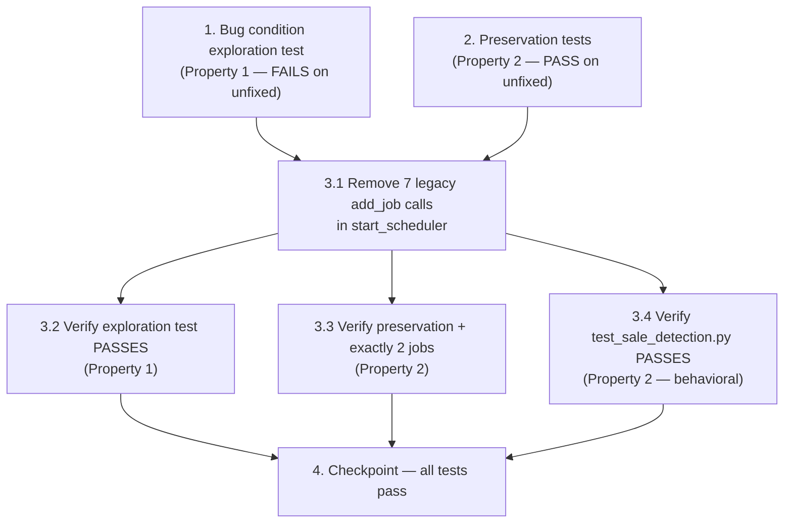

# Implementation Plan

Scope: ONLY `/projects/sandbox/Uzumchi`. The entire fix is confined to
`services/scheduler.py::start_scheduler` plus one new test file
`tests/test_scheduler_jobs.py`. No other files are touched.

Bug Condition / Preservation references come from
`.kiro/specs/disable-legacy-scheduler-notifications/design.md`:
- **Bug Condition C(X)**: `X.jobId IN {morning_reports, storage_alerts, delivered_check,
  rating_check_morning, rating_check_evening, forecast_check, returns_check}`.
- **NOT C(X)** (preserved): `X.jobId IN {product_report_morning, sale_check}`, the
  `AsyncIOScheduler(timezone=Asia/Tashkent)` construction, and `return scheduler`.
- **F**: original `start_scheduler` (registers all 9 jobs). **F'**: fixed (registers 2).

---

- [x] 1. Write bug condition exploration test (legacy jobs must NOT be registered)
  - **Property 1: Bug Condition** - Legacy Jobs Are Not Scheduled
  - File: `tests/test_scheduler_jobs.py` (new) — target under test:
    `services/scheduler.py::start_scheduler`
  - **CRITICAL**: This test MUST FAIL on the UNFIXED code — failure confirms the bug exists
    (the seven legacy `add_job(...)` calls are still present in `start_scheduler`).
  - **DO NOT attempt to fix the test or the code when it fails** at this step.
  - **NOTE**: This test encodes the expected post-fix behavior — it will validate the fix
    when it passes after implementation (re-used unchanged in task 3.2).
  - **GOAL**: Surface counterexamples that demonstrate the legacy jobs ARE currently
    registered and would fire.
  - **Scoped PBT Approach**: This is a deterministic bug, so scope the property to the
    concrete enumerated failing cases — iterate over the exact seven legacy ids
    (`LEGACY_IDS = ["morning_reports", "storage_alerts", "delivered_check",
    "rating_check_morning", "rating_check_evening", "forecast_check", "returns_check"]`)
    rather than generating random ids, ensuring reproducibility.
  - Implementation details (from Bug Condition in design):
    - Define a minimal stub bot: a plain object (e.g. `class StubBot: pass` instance or
      `object()`). `start_scheduler` only stores `bot` in each job's `args` and never calls
      it during registration, so no async/Telegram behavior is needed.
    - Call `scheduler = start_scheduler(StubBot())`.
    - **Do NOT call `scheduler.start()`** — inspect registration only, so no job executes
      and no notifications are dispatched.
    - For each `jid` in `LEGACY_IDS`, assert `scheduler.get_job(jid) is None`.
  - Run test on UNFIXED code.
  - **EXPECTED OUTCOME**: Test FAILS (this is correct — `get_job("morning_reports")` and the
    other six return a non-`None` Job on unfixed code, proving the bug exists).
  - Document counterexamples found (e.g. "`get_job('forecast_check')` returned a Job at
    cron 09:30 instead of None").
  - Mark task complete when the test is written, run, and the failure is documented.
  - _Bug_Condition: isBugCondition(X) where X.jobId in the seven legacy ids (design)_
  - _Requirements: 1.1, 1.2, 1.3, 1.4, 1.5, 1.6, 2.1, 2.2, 2.3, 2.4, 2.5, 2.6, 2.7_

- [x] 2. Write preservation tests (BEFORE implementing the fix)
  - **Property 2: Preservation** - Requested Jobs And Scheduler Construction Unchanged
  - File: `tests/test_scheduler_jobs.py` (same new file) — target:
    `services/scheduler.py::start_scheduler`
  - **IMPORTANT**: Follow observation-first methodology — run the UNFIXED `start_scheduler`,
    observe the values below, then encode those observations as assertions.
  - Observe on UNFIXED code (cases where `isBugCondition` is false) and assert they hold:
    - `scheduler.get_job("product_report_morning")` is not `None` (cron 09:00 Asia/Tashkent,
      bound to `run_product_report`).
    - `scheduler.get_job("sale_check")` is not `None` (interval 5 min, bound to
      `run_sale_check`).
    - `str(scheduler.timezone) == "Asia/Tashkent"` (scheduler constructed with TASHKENT tz).
    - `start_scheduler(StubBot())` returns an `AsyncIOScheduler` instance (return value
      preserved).
  - **EXPECTED OUTCOME on UNFIXED code**: these preservation assertions PASS (they describe
    behavior that must stay the same). Note: the "exactly 2 jobs" assertion belongs to the
    post-fix check in task 3.3, not here, because the unfixed scheduler has 9 jobs.
  - Reuse the same `StubBot` stub from task 1; do NOT call `scheduler.start()`.
  - Mark task complete when these preservation tests are written, run, and passing on
    UNFIXED code.
  - _Preservation: Preservation Requirements (design) — requested jobs, timezone, return_
  - _Requirements: 3.1, 3.2, 3.3, 3.4, 3.5, 3.6_

- [x] 3. Fix: remove the seven legacy job registrations from `start_scheduler`

  - [x] 3.1 Edit `services/scheduler.py::start_scheduler` to register only the two requested jobs
    - File: `services/scheduler.py`, function `start_scheduler(bot)`.
    - Delete the seven `scheduler.add_job(...)` blocks for the legacy ids:
      `morning_reports` (CronTrigger 08:00), `storage_alerts` (IntervalTrigger 4h),
      `delivered_check` (IntervalTrigger 10 min), `rating_check_morning` (CronTrigger 09:00),
      `rating_check_evening` (CronTrigger 18:00), `forecast_check` (CronTrigger 09:30),
      and `returns_check` (IntervalTrigger 30 min).
    - Keep ONLY the two requested `add_job` blocks UNCHANGED: `product_report_morning`
      (`CronTrigger(hour=9, minute=0, timezone=TASHKENT)`, `id="product_report_morning"`,
      `args=[bot]`, `replace_existing=True`, bound to `run_product_report`) and `sale_check`
      (`IntervalTrigger(minutes=5)`, `id="sale_check"`, `args=[bot]`,
      `replace_existing=True`, bound to `run_sale_check`).
    - Keep UNCHANGED: the `scheduler = AsyncIOScheduler(timezone=TASHKENT)` construction and
      the final `return scheduler`.
    - Keep the seven legacy `run_*` async function definitions DEFINED in the module
      (`run_morning_reports`, `run_storage_alerts`, `run_delivered_check`,
      `run_rating_check`, `run_forecast_check`, `run_returns_check`) — they become dead,
      unreferenced code per the design decision. Do NOT delete them.
    - Do NOT modify any other file (handlers, database, main.py, locales, utils, or the
      `run_product_report` / `run_sale_check` bodies and their helpers).
    - _Bug_Condition: isBugCondition(X) — X.jobId in the seven legacy ids (design)_
    - _Expected_Behavior: F' registers only product_report_morning + sale_check (design)_
    - _Preservation: Preservation Requirements (design)_
    - _Requirements: 2.1, 2.2, 2.3, 2.4, 2.5, 2.6, 2.7, 3.1, 3.2, 3.6_

  - [x] 3.2 Verify the bug condition exploration test now passes
    - **Property 1: Expected Behavior** - Legacy Jobs Are Not Scheduled
    - **IMPORTANT**: Re-run the SAME test from task 1 — do NOT write a new test.
    - The test from task 1 encodes the expected behavior; when it passes it confirms the
      seven legacy ids resolve to `None`.
    - Run: `pytest tests/test_scheduler_jobs.py -k "legacy or bug_condition" --run` (or run
      the whole file).
    - **EXPECTED OUTCOME**: Test PASSES — `scheduler.get_job(jid) is None` for all seven
      legacy ids (confirms the bug is fixed).
    - _Requirements: 2.1, 2.2, 2.3, 2.4, 2.5, 2.6, 2.7_

  - [x] 3.3 Verify preservation tests still pass and exactly 2 jobs are registered
    - **Property 2: Preservation** - Requested Jobs And Scheduler Construction Unchanged
    - **IMPORTANT**: Re-run the SAME preservation tests from task 2 — do NOT write new ones.
    - Confirm after the fix: `get_job("product_report_morning")` and `get_job("sale_check")`
      are non-`None`; `str(scheduler.timezone) == "Asia/Tashkent"`; the return value is an
      `AsyncIOScheduler`.
    - Add/confirm the post-fix count assertion: `len(scheduler.get_jobs()) == 2` and the set
      of registered ids equals `{"product_report_morning", "sale_check"}`.
    - **EXPECTED OUTCOME**: Tests PASS (confirms no regressions to the requested jobs,
      timezone, or return value).
    - _Requirements: 3.1, 3.2, 3.3, 3.4, 3.5, 3.6_

  - [x] 3.4 Verify existing sale-detection tests still pass (behavioral preservation)
    - **Property 2: Preservation** - run_sale_check / run_product_report Behavior Unchanged
    - Run the existing suite `tests/test_sale_detection.py` (covers `detect_sales`,
      `build_current_map`, `run_sale_check` first-run baseline / strict-decrease / increase,
      and `run_product_report` counts + once-per-day dedupe).
    - **EXPECTED OUTCOME**: All tests PASS unchanged — the fix only removed registrations,
      so `run_sale_check` and `run_product_report` behavior is preserved.
    - _Requirements: 3.1, 3.2, 3.5_

- [x] 4. Checkpoint - Ensure all tests pass
  - Run the full test suite (at minimum `tests/test_scheduler_jobs.py` and
    `tests/test_sale_detection.py`) and ensure everything is green.
  - Confirm: 7 legacy ids -> `None`; exactly 2 jobs registered
    (`product_report_morning`, `sale_check`); timezone `Asia/Tashkent`; existing behavior
    tests unaffected.
  - Ask the user if any questions arise.

---

## Task Dependency Graph

**Ordering rationale:**
- Tasks **1** and **2** are written and run BEFORE the fix (tests-first). Task 1 must FAIL
  (proves the bug); task 2 must PASS (captures baseline to preserve). They are independent
  of each other and both gate the implementation.
- Task **3.1** is the single code change; it depends on both pre-fix tests existing.
- Tasks **3.2**, **3.3**, **3.4** re-run the same tests after the fix and can run in any
  order once 3.1 is done.
- Task **4** is the final gate, depending on all verification tasks.
