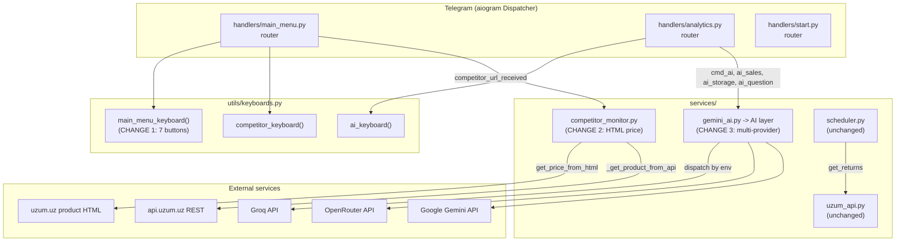
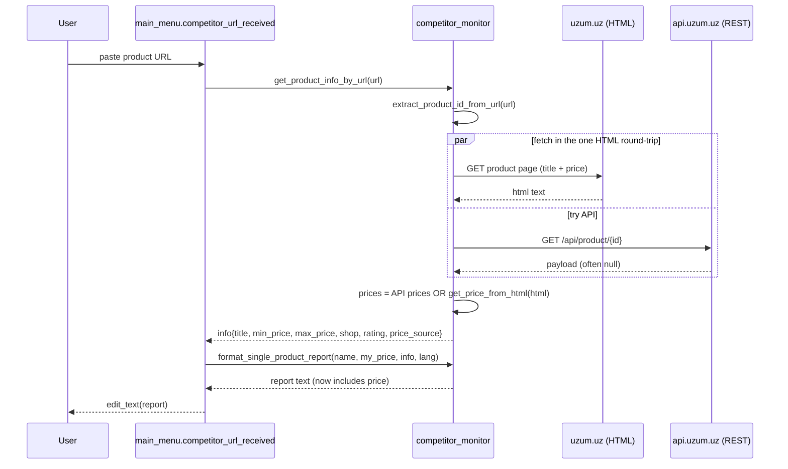
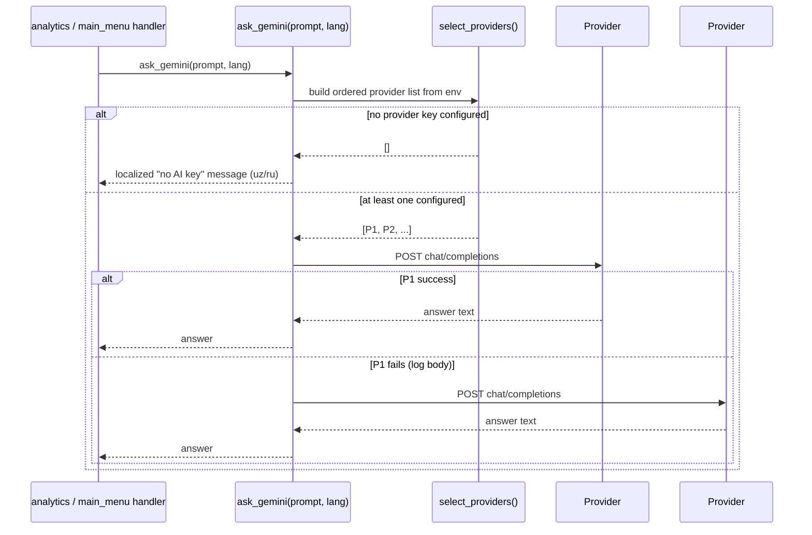

# Design Document: Menu / Competitor / AI Improvements

## Overview

This feature applies three independent, user-requested changes to the working **Uzumchi** Telegram bot (aiogram 3, Python 3.11, SQLite, APScheduler) without disturbing any of its currently working capabilities:

1. **Menu cleanup** — remove the *Weekly*, *Monthly*, and *Returns* sections from the main reply keyboard and delete their handlers/dead helpers in `handlers/analytics.py`, keeping the AI handlers in that same router intact.
2. **Reliable competitor price** — when a user pastes a valid Uzum product URL, the saved-confirmation report must show the competitor's price (min/max) reliably, even when the public REST API returns `payload=null`. We add an HTML-based price extractor in `services/competitor_monitor.py` as a primary/fallback price source.
3. **Working multi-provider AI advisor** — replace the Gemini-only, format-locked client in `services/gemini_ai.py` with a provider-agnostic layer (Groq → OpenRouter → Gemini), keeping the public entrypoint `ask_gemini(prompt, lang)` and the three prompt builders unchanged so no handler code has to change.

The guiding principle is **maximum behavior preservation, minimal blast radius**. Each change is local to one or two modules. Public function names consumed by handlers (`ask_gemini`, `build_*_prompt`, `get_product_info_by_url`, `format_single_product_report`, `main_menu_keyboard`) keep their signatures so call sites are untouched (except the keyboard layout itself and the analytics import list).

This is a **design-only** document. No source code is modified by this spec.

---

## Scope

### In scope (files edited in `/projects/sandbox/Uzumchi` only)
- `utils/keyboards.py` — remove three buttons + fix `.adjust(...)`.
- `handlers/analytics.py` — remove `cmd_weekly`, `cmd_monthly`, `cmd_returns` + now-dead helpers/imports; keep AI handlers.
- `handlers/main_menu.py` — route competitor price through the improved extractor (no signature change; behavior only).
- `services/competitor_monitor.py` — add HTML price extraction (`get_price_from_html`) + wire it into `get_product_info_by_url`.
- `services/gemini_ai.py` — turn into a provider-agnostic AI layer; keep `ask_gemini` and prompt builders.
- `locales/i18n.py` — verify `btn_weekly/btn_monthly/btn_returns` are no longer referenced; **keep the keys** to minimize churn (documented decision).
- `.env.example` — document `GROQ_API_KEY` / `OPENROUTER_API_KEY` / `GEMINI_API_KEY` / `AI_PROVIDER`.
- `tests/` — update `test_report_403_integration.py` (remove weekly/monthly cases that target deleted handlers); add new unit tests.

### Out of scope / must NOT break (preservation contract)
- `uzum_seller_bot/` is **read-only reference**; never edited.
- `services/scheduler.py` — left as-is. It imports `get_returns` from `services.uzum_api` (for `run_returns_check`) and uses scheduler-only i18n keys (`sched_returns`, etc.). None of those are removed, so the scheduler keeps working.
- `services/uzum_api.py` — `get_returns`, `get_expenses`, `get_fbs_orders_period` **definitions stay** (scheduler still needs `get_returns`; the others are harmless and cheap to keep). Only the *imports* of `get_expenses`/`get_fbs_orders_period` inside `analytics.py` are removed.
- Products, Orders, Storage, Daily report (incl. 403 product-fallback), finance overlay, competitor monitor list view (`check_saved_urls`), multi-shop, charts, `/ping` & `/health`, self-ping — all unchanged.

---

# PART 1 — HIGH-LEVEL DESIGN (Diagrams & Interfaces)

## Architecture



### Change-to-module map

| Change | Primary module(s) | Public surface kept stable | What callers see |
|--------|-------------------|----------------------------|------------------|
| 1 — Remove Weekly/Monthly/Returns | `utils/keyboards.py`, `handlers/analytics.py` | `main_menu_keyboard(lang)` name kept | 3 fewer buttons; AI menu unchanged |
| 2 — Competitor price | `services/competitor_monitor.py` | `get_product_info_by_url`, `format_single_product_report` | Saved-URL report shows min/max price reliably |
| 3 — AI advisor | `services/gemini_ai.py` | `ask_gemini`, `build_sales_analysis_prompt`, `build_storage_advice_prompt`, `build_competitor_advice_prompt` | AI answers instead of erroring on non-`AIzaSy` keys |

## Sequence Diagrams

### Change 2 — Competitor price extraction (URL added)



### Change 3 — AI provider dispatch



## Components and Interfaces

### Component: `utils/keyboards.py :: main_menu_keyboard`

**Purpose**: Build the main reply keyboard. After Change 1 it exposes 7 buttons.

**Interface** (unchanged signature):
```python
def main_menu_keyboard(lang: str = "ru") -> ReplyKeyboardMarkup: ...
```

**Responsibilities**:
- Render exactly: Products, Orders, Storage, Report, Competitor, AI, Settings.
- Never render Weekly / Monthly / Returns.
- Produce a valid `.adjust(...)` layout for 7 buttons.

### Component: `services/competitor_monitor.py`

**Purpose**: Resolve a Uzum product URL to `{title, min_price, max_price, shop, rating, reviews, ...}`.

**Interface** (names preserved; one new function added):
```python
def get_price_from_html(html: str) -> tuple[float, float] | None       # NEW: (min, max) or None
async def get_product_info_by_url(uzum_url: str) -> dict | None          # behavior extended
def format_single_product_report(product_name, my_price, info, lang="ru") -> str  # unchanged
```

**Responsibilities**:
- Parse price from already-fetched product-page HTML (JSON-LD offers + embedded state JSON keys).
- Use API price when present; fall back to HTML price when API yields no price or `payload=null`.
- Never raise to the handler (return `None`/zeros on failure, as today).

### Component: `services/gemini_ai.py` (AI layer)

**Purpose**: Provider-agnostic text completion for sales/storage/competitor/free-form advice.

**Interface** (public surface preserved):
```python
async def ask_gemini(prompt: str, lang: str = "ru") -> str               # name kept; now multi-provider
def build_sales_analysis_prompt(stats, products, lang="ru") -> str       # unchanged
def build_storage_advice_prompt(storage_items, lang="ru") -> str         # unchanged
def build_competitor_advice_prompt(name, my, avg, min_, lang="ru") -> str# unchanged
```

**Internal (new, private) helpers**:
```python
def _select_providers() -> list[ProviderConfig]    # ordered by AI_PROVIDER / which keys are set
async def _call_openai_compatible(cfg, prompt) -> str   # Groq + OpenRouter share the schema
async def _call_gemini(cfg, prompt) -> str              # generativelanguage v1beta
```

## Data Models

### `ProviderConfig` (internal)
```python
@dataclass(frozen=True)
class ProviderConfig:
    name: str            # "groq" | "openrouter" | "gemini"
    api_key: str
    endpoint: str
    model: str
    kind: str            # "openai" | "gemini"
```
**Validation rules**:
- `api_key` must be non-empty (the **only** key check — no `AIzaSy` prefix requirement).
- `kind == "openai"` uses the OpenAI chat-completions schema; `kind == "gemini"` uses the Gemini `generateContent` schema.

### `info` dict returned by `get_product_info_by_url` (extended, backward compatible)
```python
{
  "title": str,
  "price": float,        # midpoint (kept for existing callers)
  "min_price": float,
  "max_price": float,
  "shop": str,
  "rating": float,
  "reviews": int,
  "product_id": str,
  "url": str,
  "price_source": str,   # NEW (informational): "api" | "html" | "none"
  "html_only": bool,     # kept; True only when neither API nor HTML yielded a price
}
```
**Validation rules**:
- A price is accepted only if `value > 100` (matches existing `_extract_prices` heuristic, filters out ratings/counts/cents artifacts).
- `min_price <= max_price`; when only one price is found `min_price == max_price`.

## Error Handling

| Scenario | Condition | Response | Recovery |
|----------|-----------|----------|----------|
| API `payload=null` | REST returns no usable payload | Fall back to HTML price | `get_price_from_html(html)` |
| No price anywhere | API + HTML both empty | `info.html_only=True`, `price_source="none"` | Report shows existing "price not obtained" note (uz/ru) |
| No AI key configured | none of GROQ/OPENROUTER/GEMINI set | Return localized "AI not configured" string | User adds a key to `.env` |
| AI provider HTTP error | non-200 from provider | Log status + **response body**; try next provider | Next configured provider, else localized error |
| AI timeout | `asyncio.TimeoutError` | Log; try next provider | Next provider, else localized timeout msg |
| HTML fetch fails | network/SSL/non-200 | Caught, returns `None` price | API path or html_only note |

## Testing Strategy

### Unit testing
- **Price extraction** (`get_price_from_html`): feed sample HTML fixtures (JSON-LD `offers.price`, `lowPrice`/`highPrice`, embedded `"sellPrice"`/`"minSellPrice"`), assert correct `(min, max)`; assert `None` when no price; assert values `<= 100` are rejected.
- **AI provider selection** (`_select_providers`): set/clear env vars via `monkeypatch`, assert ordering (Groq → OpenRouter → Gemini), `AI_PROVIDER` override, and empty list when nothing configured.
- **AI dispatch** (`ask_gemini`): mock the HTTP session; assert success path, fallback-to-next-provider on first failure, and localized message when no key.
- **Keyboard** (`main_menu_keyboard`): assert the rendered button texts contain Products/Orders/Storage/Report/Competitor/AI/Settings and **do not** contain the weekly/monthly/returns labels in either language.
- **Router import** (`handlers/analytics.py`): `import handlers.analytics` succeeds and `router` has the AI handlers; removed handlers are absent.

### Property-based testing
- **Library**: `hypothesis` (already present — see `.hypothesis/`).
- **Property**: for any float list with values `> 100`, `get_price_from_html` on synthesized HTML returns `min == min(values)` and `max == max(values)`; values `<= 100` never appear in the result.

### Integration testing
- Update `tests/test_report_403_integration.py`: keep the **daily** report cases (Change-1 doesn't touch `cmd_report_today`), and **remove** the weekly/monthly cases that drive the deleted `cmd_weekly`/`cmd_monthly` handlers.
- Smoke test: `import main` (transitively imports all three routers + scheduler) succeeds.

## Security Considerations
- API keys are read from environment only; never logged in full. When logging provider failures, log status code and response **body** (provider errors don't echo the key) but never print the key itself.
- Existing permissive SSL context (`CERT_NONE`) and browser-like headers are preserved for Uzum endpoints (the bot already depends on this to reach Uzum from restricted hosts). AI provider calls use default TLS verification.

## Dependencies
- No new third-party packages required. `aiohttp` (already in `requirements.txt`) covers all provider and HTML calls. `hypothesis` already available for PBT.
- Network mode is **OPEN_INTERNET**, so Groq/OpenRouter/Gemini and `uzum.uz` are reachable at runtime.

---

# PART 2 — LOW-LEVEL DESIGN (Code-First, Python)

## CHANGE 1 — Remove Weekly / Monthly / Returns

### File: `utils/keyboards.py`

**Current** `main_menu_keyboard` builds 10 buttons with `builder.adjust(2, 2, 2, 2, 1, 1)`.

**Change**: remove the three `builder.button(... btn_weekly/btn_monthly/btn_returns ...)` lines and fix the layout for the remaining 7 buttons.

```python
def main_menu_keyboard(lang: str = "ru") -> ReplyKeyboardMarkup:
    """Asosiy menyu tugmalari (7 ta)."""
    builder = ReplyKeyboardBuilder()
    builder.button(text=t("btn_products", lang))
    builder.button(text=t("btn_orders", lang))
    builder.button(text=t("btn_storage", lang))
    builder.button(text=t("btn_report", lang))
    builder.button(text=t("btn_competitor", lang))
    builder.button(text=t("btn_ai", lang))
    builder.button(text=t("btn_settings", lang))
    # 7 buttons: three rows of two + a final single
    builder.adjust(2, 2, 2, 1)
    return builder.as_markup(resize_keyboard=True)
```

**Layout rationale**: `2 + 2 + 2 + 1 = 7` exactly covers the seven buttons. Order keeps Competitor and AI adjacent (row 3) and Settings alone on the last row.

### File: `handlers/analytics.py`

**Remove**:
- The handlers `cmd_weekly` (`F.text.in_(["📈 Haftalik", "📈 Недельный"])`), `cmd_monthly` (`["📅 Oylik", "📅 Месячный"]`), `cmd_returns` (`["↩️ Qaytarmalar", "↩️ Возвраты"]`).
- The now-dead module-level helpers `_build_daily_data(...)` and `_is_in_week(...)`.
- Unused names from the `services.uzum_api` import: `get_fbs_orders_period`, `get_returns`, `get_expenses`, and also `get_finance_orders`, `summarize_finance_orders`, `_days_ago_ms`, `_now_ms` **iff** the AI handlers don't use them (they do not — verified). Keep names the AI path still needs: `get_products`, `get_invoices`, `summarize_orders`, `get_sales_stats_from_products`.
- `report_fallback` import (`build_product_fallback_report`, `product_stats_available`) — only used by the removed weekly/monthly handlers; remove it.
- `import datetime` (only used by removed helpers).

**Keep** (the AI surface and its dependencies):
- `cmd_ai`, `ai_sales_analysis`, `ai_storage_advice`, `ai_question_start`, `ai_question_process`, `ai_back`, the `AIStates` group and `router`.
- Imports actually used by AI handlers: `get_products`, `get_invoices`, `summarize_orders`, `get_fbs_orders_period`? — **note:** `ai_sales_analysis` currently calls `get_fbs_orders_period(user["api_key"], days=7)`. Therefore `get_fbs_orders_period` is **still used** by the AI path and MUST remain imported.

> **Verification result (import audit for the trimmed file):**
> - `get_fbs_orders_period` → used by `ai_sales_analysis` → **keep import**.
> - `get_products` → used by `ai_sales_analysis` → keep.
> - `get_invoices` → used by `ai_storage_advice` → keep.
> - `summarize_orders` → used by `ai_sales_analysis` → keep.
> - `get_returns`, `get_expenses`, `get_finance_orders`, `summarize_finance_orders`, `get_sales_stats_from_products`, `_days_ago_ms`, `_now_ms` → only used by removed handlers → **drop from import**.
> - `parse_invoices`, `get_storage_alerts` from `storage_tracker` → `parse_invoices` used by `ai_storage_advice` (keep); `get_storage_alerts` unused → drop.
> - `ask_gemini`, `build_sales_analysis_prompt`, `build_storage_advice_prompt` → keep.
> - `main_menu_keyboard`, `back_keyboard`, `ai_keyboard`, `cancel_keyboard` → `back_keyboard` unused after trim → drop; keep the other three.
> - `safe_float`, `safe_int`, `short_name`, `format_price` from helpers → none used by AI handlers → **drop the whole helpers import**.
> - `report_fallback` import → drop.
> - `import datetime` → drop.

**Resulting import block (target state):**
```python
import logging
from aiogram import Router, F
from aiogram.types import Message, CallbackQuery
from aiogram.fsm.context import FSMContext
from aiogram.fsm.state import State, StatesGroup

from database import get_user
from services.uzum_api import (
    get_fbs_orders_period, get_products, get_invoices, summarize_orders,
)
from services.storage_tracker import parse_invoices
from services.gemini_ai import (
    ask_gemini, build_sales_analysis_prompt, build_storage_advice_prompt,
)
from locales.i18n import t
from utils.keyboards import main_menu_keyboard, ai_keyboard, cancel_keyboard
```

> The final import list MUST be reconciled against the exact bodies of the kept AI handlers at implementation time (remove any name that ends up unused, add back any that is used). The audit above is the intended target.

### File: `locales/i18n.py`

**Decision: KEEP** `btn_weekly`, `btn_monthly`, `btn_returns` keys (and `report_weekly*`, `report_monthly*`, `returns_*` keys).
**Rationale**:
- They are still referenced by **`services/scheduler.py`** indirectly? — No. But `sched_returns` (a *different* key) is used by the scheduler and is **not** being removed.
- `report_weekly_body`, `report_monthly_body`, `finance_*` etc. are asserted by **`tests/test_i18n.py`** (`NEW_KEYS`). Removing them would break that test. Keeping them is zero-cost and avoids churn.
- `btn_weekly/btn_monthly/btn_returns` become unreferenced by the keyboard but remain harmless dictionary entries.

**Action**: no edits to `i18n.py` beyond confirming nothing in production code references the removed buttons (the only reference was `main_menu_keyboard`, now gone).

### File: `main.py`
No change. It still does `from handlers.analytics import router as analytics_router` and `dp.include_router(analytics_router)`. The router object continues to exist with the AI handlers registered.

### File: `services/scheduler.py`
No change. Confirmed it imports `get_returns` from `services.uzum_api` (kept) and uses `sched_*` i18n keys (kept). The scheduler's `run_returns_check` is independent of the removed UI handlers.

### Tests impacted by Change 1
- `tests/test_report_403_integration.py` drives `an.cmd_weekly` and `an.cmd_monthly` (4 test functions: `test_weekly_fallback_on_403_orders`, `test_weekly_orders_present_unchanged`, `test_monthly_fallback_on_403_orders`, `test_monthly_orders_present_unchanged`). These handlers are being deleted, so **those four tests must be removed**. The three **daily** tests (`cmd_report_today` in `main_menu.py`) remain valid and must keep passing.

---

## CHANGE 2 — Reliable competitor price from HTML

### File: `services/competitor_monitor.py`

**Problem**: `_get_product_from_api` frequently logs `payload=null` → `get_product_info_by_url` returns `html_only=True` with zero prices → `format_single_product_report` prints "narx olinmadi" / "Цена не получена".

**Approach**: The product page HTML is already fetched for the title. Reuse that HTML to extract price from:
1. **JSON-LD** `<script type="application/ld+json">` → `offers.price`, or `offers.lowPrice` / `offers.highPrice`.
2. **Embedded state JSON** keys commonly present in Uzum's page bundle: `"sellPrice"`, `"purchasePrice"`, `"minSellPrice"`, `"price"`, `"fullPrice"` — same `> 100` heuristic already used by `_extract_prices`.

**New function** (synchronous, pure — easy to unit test):
```python
def get_price_from_html(html: str) -> tuple[float, float] | None:
    """
    Extract (min_price, max_price) from a Uzum product page's HTML.
    Returns None when no plausible price (> 100) is found.
    """
    prices: list[float] = []

    # 1) JSON-LD offers
    for block in re.findall(
        r'<script[^>]+type=["\']application/ld\+json["\'][^>]*>(.*?)</script>',
        html, re.DOTALL | re.IGNORECASE,
    ):
        try:
            data = json.loads(block.strip())
        except Exception:
            continue
        for node in (data if isinstance(data, list) else [data]):
            offers = node.get("offers") if isinstance(node, dict) else None
            for off in (offers if isinstance(offers, list) else [offers]):
                if not isinstance(off, dict):
                    continue
                for key in ("price", "lowPrice", "highPrice"):
                    _accumulate_price(off.get(key), prices)

    # 2) Embedded state JSON keys (regex over raw HTML — robust to bundling)
    for key in ("sellPrice", "purchasePrice", "minSellPrice", "price", "fullPrice"):
        for m in re.findall(rf'"{key}"\s*:\s*"?(\d[\d.]*)"?', html):
            _accumulate_price(m, prices)

    if not prices:
        return None
    return (min(prices), max(prices))


def _accumulate_price(value, prices: list[float]) -> None:
    try:
        v = float(value)
    except (TypeError, ValueError):
        return
    if v > 100:
        prices.append(v)
```

**Refactor `get_product_title_from_html` → also return HTML** so we don't double-fetch. Introduce a small fetch helper used by both title and price:
```python
async def _fetch_product_html(url: str) -> str | None:
    """Single GET of the product page; returns HTML text or None."""
    try:
        async with aiohttp.ClientSession(
            connector=aiohttp.TCPConnector(ssl=SSL_CONTEXT),
            headers=HTML_HEADERS,
        ) as session:
            async with session.get(url, timeout=aiohttp.ClientTimeout(total=15)) as resp:
                if resp.status != 200:
                    logger.warning(f"[COMP] HTML {url} -> {resp.status}")
                    return None
                return await resp.text()
    except Exception as e:
        logger.warning(f"[COMP] HTML fetch error: {e}")
        return None


def _title_from_html(html: str) -> str | None:
    """Pure title parse (og:title -> <title> -> JSON-LD name) — extracted from
    the existing get_product_title_from_html body."""
    ...  # same three regex steps as today, operating on `html`
```

`get_product_title_from_html` keeps its name/signature for compatibility but becomes a thin wrapper:
```python
async def get_product_title_from_html(url: str) -> str | None:
    html = await _fetch_product_html(url)
    return _title_from_html(html) if html else None
```

**Wire into `get_product_info_by_url`** — fetch HTML once, derive both title and HTML-price, and use HTML price as primary when API has no price:
```python
async def get_product_info_by_url(uzum_url: str) -> dict | None:
    product_id = extract_product_id_from_url(uzum_url)
    if not product_id:
        logger.warning(f"[COMP] URL dan ID ajratilmadi: {uzum_url}")
        return None

    html = await _fetch_product_html(uzum_url)
    title_from_html = _title_from_html(html) if html else None
    html_prices = get_price_from_html(html) if html else None

    api_data = await _get_product_from_api(product_id)

    if api_data:
        if title_from_html and (not api_data.get("title") or api_data["title"] == "—"):
            api_data["title"] = title_from_html
        # API gave a usable price?
        api_min = api_data.get("min_price") or 0
        if api_min <= 0 and html_prices:                 # API price missing -> HTML fallback
            lo, hi = html_prices
            api_data.update(min_price=lo, max_price=hi,
                            price=(lo + hi) / 2, price_source="html", html_only=False)
        else:
            api_data["price_source"] = "api"
        api_data["url"] = uzum_url
        return api_data

    # API failed entirely -> HTML primary
    if title_from_html or html_prices:
        lo, hi = html_prices if html_prices else (0.0, 0.0)
        return {
            "title": (title_from_html or "Tovar")[:60],
            "price": (lo + hi) / 2, "min_price": lo, "max_price": hi,
            "shop": "—", "rating": 0, "reviews": 0,
            "product_id": product_id, "url": uzum_url,
            "price_source": "html" if html_prices else "none",
            "html_only": html_prices is None,
        }
    return None
```

**`format_single_product_report` stays unchanged** — it already renders min/max when `market_min > 0`. With HTML prices now populating `min_price`/`max_price`, the existing branch fires and shows the competitor price.

**Preserved**: SSL context, `HTML_HEADERS`/`API_HEADERS`, `_get_product_from_api`, `_extract_prices`, `check_saved_urls` (it calls `get_product_info_by_url`, so it transparently benefits from the HTML fallback too).

### File: `handlers/main_menu.py`
**No signature/logic change required.** `competitor_url_received` already calls `get_product_info_by_url` then `format_single_product_report`. Because the info dict now carries real prices, the existing call path shows the price. (Optional cosmetic: none needed.)

---

## CHANGE 3 — Multi-provider AI advisor

### File: `services/gemini_ai.py` (becomes the provider-agnostic AI layer)

**Remove** the hard format check:
```python
# DELETE THIS BLOCK:
if not GEMINI_API_KEY.startswith("AIzaSy"):
    ... return "wrong format" ...
```

**Provider selection** — ordered list built from env. Priority: Groq → OpenRouter → Gemini. `AI_PROVIDER` forces one to the front (and, if set, restricts to that single provider when its key exists).

```python
import os
from dataclasses import dataclass

GROQ_API_KEY       = os.getenv("GROQ_API_KEY", "")
OPENROUTER_API_KEY = os.getenv("OPENROUTER_API_KEY", "")
GEMINI_API_KEY     = os.getenv("GEMINI_API_KEY", "")
AI_PROVIDER        = os.getenv("AI_PROVIDER", "").strip().lower()  # "", "groq", "openrouter", "gemini"

GROQ_MODEL   = os.getenv("GROQ_MODEL", "llama-3.3-70b-versatile")
OPENROUTER_MODEL = os.getenv("OPENROUTER_MODEL", "meta-llama/llama-3.3-70b-instruct")
GEMINI_MODEL = os.getenv("GEMINI_MODEL", "gemini-1.5-flash")


@dataclass(frozen=True)
class ProviderConfig:
    name: str
    api_key: str
    endpoint: str
    model: str
    kind: str  # "openai" | "gemini"


def _all_providers() -> dict[str, ProviderConfig]:
    out: dict[str, ProviderConfig] = {}
    if GROQ_API_KEY:
        out["groq"] = ProviderConfig(
            "groq", GROQ_API_KEY,
            "https://api.groq.com/openai/v1/chat/completions", GROQ_MODEL, "openai")
    if OPENROUTER_API_KEY:
        out["openrouter"] = ProviderConfig(
            "openrouter", OPENROUTER_API_KEY,
            "https://openrouter.ai/api/v1/chat/completions", OPENROUTER_MODEL, "openai")
    if GEMINI_API_KEY:
        out["gemini"] = ProviderConfig(
            "gemini", GEMINI_API_KEY,
            f"https://generativelanguage.googleapis.com/v1beta/models/{GEMINI_MODEL}:generateContent",
            GEMINI_MODEL, "gemini")
    return out


def _select_providers() -> list[ProviderConfig]:
    available = _all_providers()
    if not available:
        return []
    if AI_PROVIDER and AI_PROVIDER in available:
        return [available[AI_PROVIDER]]              # explicit override -> only that one
    order = ["groq", "openrouter", "gemini"]          # default priority
    return [available[name] for name in order if name in available]
```

### AI provider dispatch pseudocode (the core entrypoint)

```python
async def ask_gemini(prompt: str, lang: str = "ru") -> str:
    """Provider-agnostic completion. Name kept for call-site compatibility."""
    providers = _select_providers()
    if not providers:
        return (
            "⚠️ AI sozlanmagan. .env ga GROQ_API_KEY (yoki OPENROUTER_API_KEY / "
            "GEMINI_API_KEY) qo'shing."
            if lang == "uz" else
            "⚠️ AI не настроен. Добавьте GROQ_API_KEY (или OPENROUTER_API_KEY / "
            "GEMINI_API_KEY) в .env."
        )

    last_error = ""
    for cfg in providers:
        try:
            if cfg.kind == "openai":
                text = await _call_openai_compatible(cfg, prompt)
            else:
                text = await _call_gemini(cfg, prompt)
            if text:
                return text
            last_error = f"{cfg.name}: empty response"
        except Exception as e:
            last_error = f"{cfg.name}: {e}"
            logger.error(f"AI provider {cfg.name} failed: {e}")
            continue   # try next configured provider

    logger.error(f"All AI providers failed. Last: {last_error}")
    return (
        f"⚠️ AI javob bermadi. Keyinroq urinib ko'ring."
        if lang == "uz" else
        f"⚠️ AI не ответил. Попробуйте позже."
    )


async def _call_openai_compatible(cfg: ProviderConfig, prompt: str) -> str:
    """Groq + OpenRouter share the OpenAI chat-completions schema."""
    headers = {"Authorization": f"Bearer {cfg.api_key}", "Content-Type": "application/json"}
    payload = {
        "model": cfg.model,
        "messages": [{"role": "user", "content": prompt}],
        "temperature": 0.7,
        "max_tokens": 1024,
    }
    async with aiohttp.ClientSession() as session:   # default TLS for these hosts
        async with session.post(cfg.endpoint, headers=headers, json=payload,
                                timeout=aiohttp.ClientTimeout(total=30)) as resp:
            body = await resp.text()
            if resp.status != 200:
                logger.error(f"{cfg.name} {resp.status}: {body[:300]}")  # log actual body
                raise RuntimeError(f"{cfg.name} HTTP {resp.status}")
            data = json.loads(body)
            return (data["choices"][0]["message"]["content"] or "").strip()


async def _call_gemini(cfg: ProviderConfig, prompt: str) -> str:
    """Google Gemini generateContent (v1beta). Keeps permissive SSL like today."""
    payload = {
        "contents": [{"parts": [{"text": prompt}]}],
        "generationConfig": {"temperature": 0.7, "maxOutputTokens": 1024},
    }
    async with aiohttp.ClientSession(
        connector=aiohttp.TCPConnector(ssl=SSL_CONTEXT)
    ) as session:
        async with session.post(cfg.endpoint, params={"key": cfg.api_key}, json=payload,
                                timeout=aiohttp.ClientTimeout(total=30)) as resp:
            body = await resp.text()
            if resp.status != 200:
                logger.error(f"gemini {resp.status}: {body[:300]}")
                raise RuntimeError(f"gemini HTTP {resp.status}")
            data = json.loads(body)
            cands = data.get("candidates", [])
            if cands:
                parts = cands[0].get("content", {}).get("parts", [])
                if parts:
                    return (parts[0].get("text", "") or "").strip()
            return ""
```

**Prompt builders unchanged**: `build_sales_analysis_prompt`, `build_storage_advice_prompt`, `build_competitor_advice_prompt` keep their exact signatures and bodies. Handlers in `analytics.py`/`main_menu.py` that call `ask_gemini(...)` need no edits.

### File: `.env.example`
Add AI provider documentation (Groq recommended as the easy free default):
```bash
# ── AI advisor (pick at least one; priority: Groq -> OpenRouter -> Gemini) ──
# Recommended easy free default:
GROQ_API_KEY=your_groq_api_key_here
GROQ_MODEL=llama-3.3-70b-versatile
# Alternative providers:
OPENROUTER_API_KEY=
OPENROUTER_MODEL=meta-llama/llama-3.3-70b-instruct
GEMINI_API_KEY=your_gemini_api_key_here
GEMINI_MODEL=gemini-1.5-flash
# Force a specific provider (optional): groq | openrouter | gemini
AI_PROVIDER=
```
(The existing `GEMINI_API_KEY=` line is replaced by the block above.)

---

## Correctness Properties

Universal statements the implementation must satisfy:

1. **Keyboard exclusivity** — ∀ `lang ∈ {uz, ru}`: the set of button texts produced by `main_menu_keyboard(lang)` contains exactly {Products, Orders, Storage, Report, Competitor, AI, Settings}(lang) and contains none of {btn_weekly, btn_monthly, btn_returns}(lang).
2. **Keyboard layout validity** — the sum of the `.adjust(...)` row sizes equals the number of buttons (7).
3. **Analytics router integrity** — `import handlers.analytics` succeeds with no `ImportError`/`NameError`, and `router` still has handlers for `cmd_ai`, `ai_sales`, `ai_storage`, `ai_question`, `ai_back`.
4. **Price extraction soundness** — ∀ HTML `h`: if `get_price_from_html(h)` returns `(lo, hi)` then `lo = min(P)`, `hi = max(P)` where `P` = all parsed numeric values `> 100`; if `P = ∅` it returns `None`.
5. **Price threshold** — no value `≤ 100` ever appears in the returned `(min, max)`.
6. **API-preserves-when-present** — if `_get_product_from_api` returns a payload with `min_price > 0`, `get_product_info_by_url` keeps the API price (`price_source == "api"`) and does not overwrite it with HTML.
7. **Report shows price when available** — if `info.min_price > 0`, `format_single_product_report(...)` output contains the price (the "Narxlar/Цены" block), regardless of whether the source was api or html.
8. **Provider ordering** — `_select_providers()` returns providers in {groq, openrouter, gemini} priority order, filtered to those whose key is set; when `AI_PROVIDER` names an available provider, the result is exactly `[that provider]`.
9. **No-key behavior** — if no provider key is set, `ask_gemini` returns a non-empty localized message (uz or ru) and performs **no** network call.
10. **Fallback dispatch** — if the first provider raises, `ask_gemini` attempts the next configured provider before returning an error.
11. **Key-format liberty** — `ask_gemini` never rejects a key for not starting with `AIzaSy`; any non-empty key is usable.
12. **Preservation** — `cmd_report_today`, orders, storage, products, finance overlay, `check_saved_urls`, scheduler jobs, `/ping`, `/health`, and the daily 403 product-fallback continue to behave exactly as before (no signatures changed in their modules).

---

## Implementation Order (recommended)

1. **Change 1** (keyboards + analytics trim + test removal) — smallest, unblocks a clean menu.
2. **Change 3** (AI layer) — isolated to `gemini_ai.py` + `.env.example`; high user value.
3. **Change 2** (competitor HTML price) — touches `competitor_monitor.py` only.

Each change is independently shippable and independently testable.
