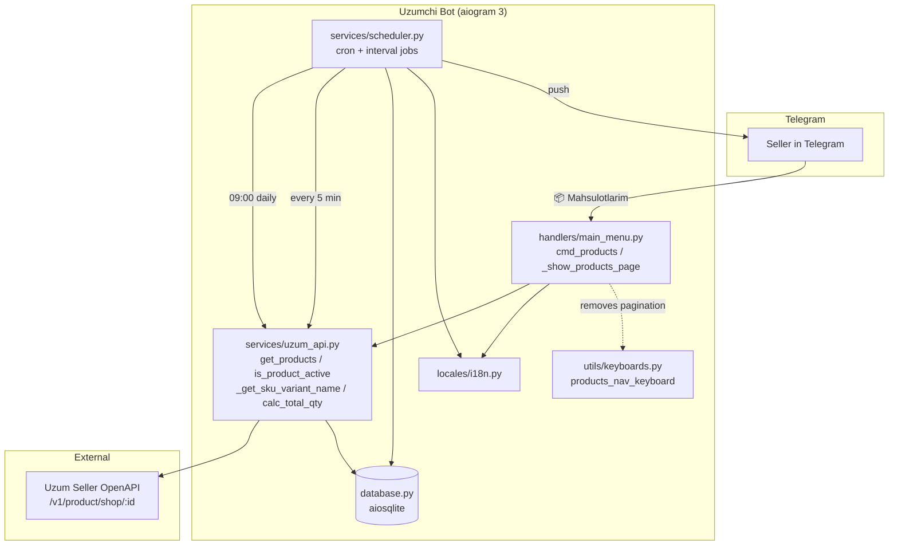
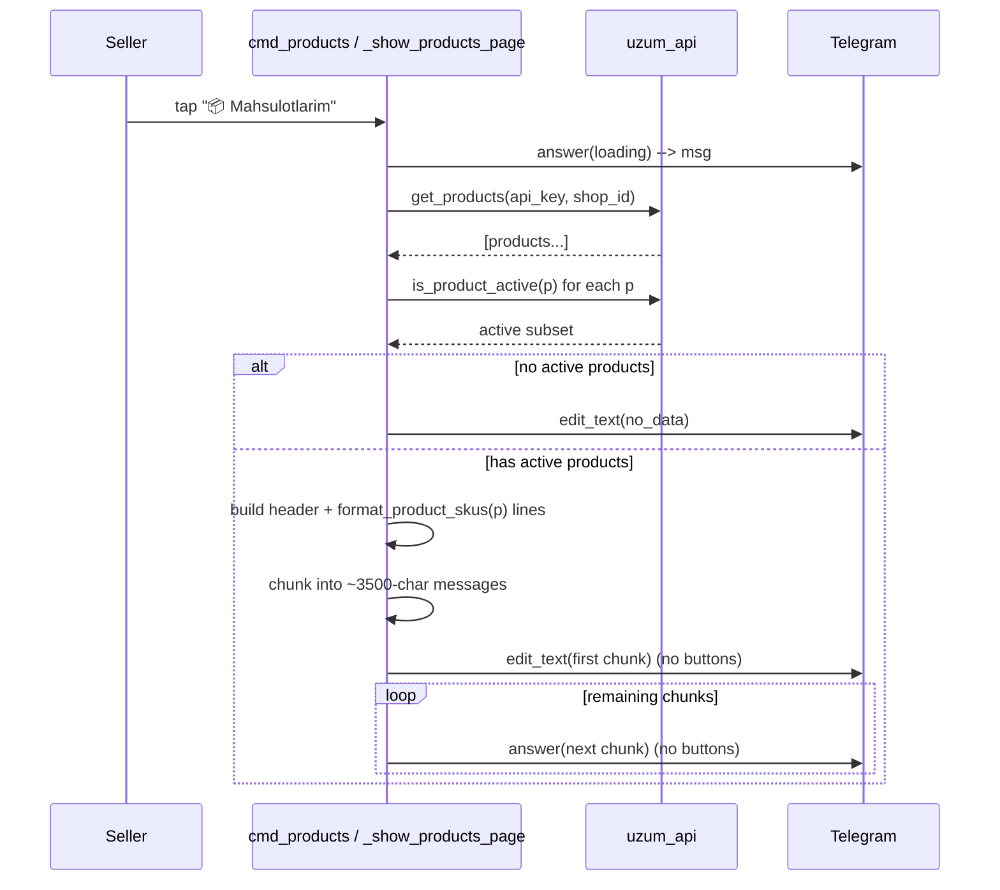
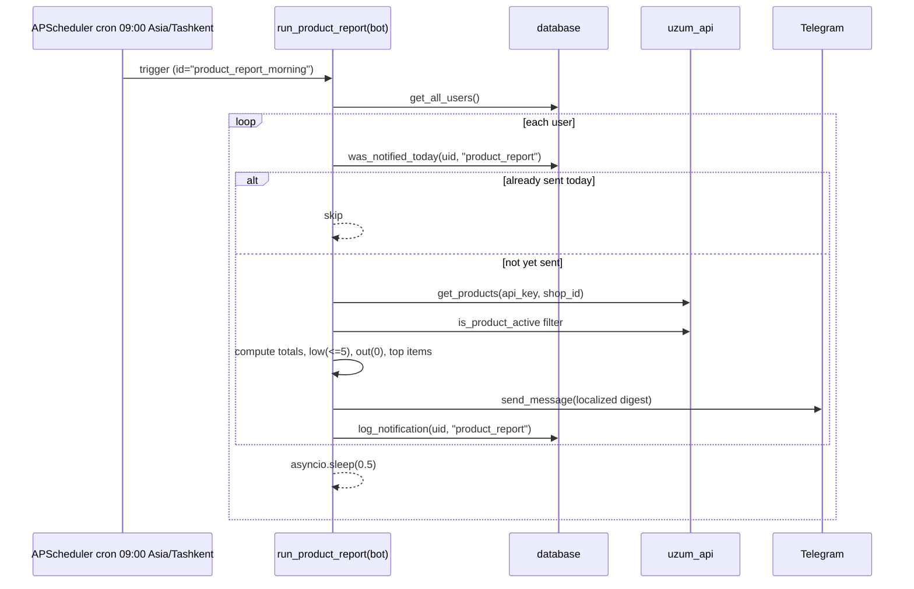
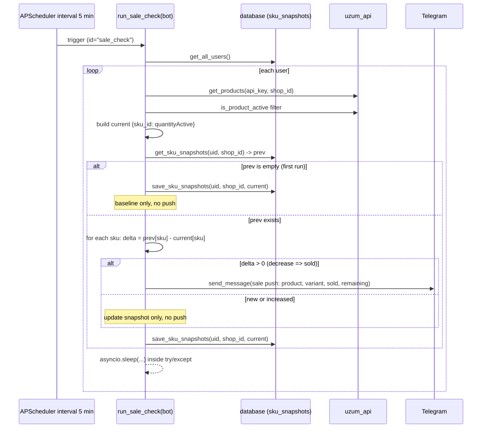

# Design Document: Products Daily & Sale Notifications

## Overview

This feature extends the existing **Uzumchi** Telegram bot (aiogram 3, aiosqlite, APScheduler,
pytz `Asia/Tashkent`) with three additive capabilities for Uzum sellers:

1. **Active-only single-page products view** — the `📦 Mahsulotlarim` screen filters out
   archived/inactive products and renders *all* remaining active products across one or more
   plain text messages (no inline pagination buttons).
2. **Daily 09:00 product report** — a new scheduled cron job that pushes a localized (uz + ru)
   digest of each seller's active catalogue: total active products, total stock, low-stock and
   out-of-stock counts, plus a short list of the most urgent items.
3. **Per-sale push via quantity-decrease detection** — because the Uzum orders API returns 403
   for these accounts, real-time sale notifications are derived by polling `get_products` every
   5 minutes, snapshotting per-SKU `quantityActive`, and pushing a notification whenever a SKU's
   active quantity *decreases* between snapshots (interpreted as units sold).

The design is deliberately **additive and non-destructive**. All existing behaviour — orders,
storage, competitor monitoring, AI advisor, the 6-button main menu, multi-shop support, charts,
the existing scheduler jobs, and the `/ping` & `/health` endpoints — remains unchanged. The only
files touched are: `handlers/main_menu.py`, `utils/keyboards.py`, `services/uzum_api.py`,
`services/scheduler.py`, `database.py`, and `locales/i18n.py`.

> **Implementation language:** Python (the existing codebase). All low-level pseudocode below maps
> directly to Python with `aiogram`, `aiosqlite`, and `APScheduler` idioms already in use.

---

## Architecture



**Component responsibilities (delta only):**

| Component | New / Changed responsibility |
|-----------|------------------------------|
| `services/uzum_api.py` | Add pure `is_product_active(p)` helper used by all three features. |
| `handlers/main_menu.py` | Filter products to active-only; remove pagination; chunk all active products into ~3500-char messages with no page buttons. |
| `utils/keyboards.py` | `products_nav_keyboard` no longer called by the products view (kept or deprecated — see Low-Level). |
| `services/scheduler.py` | Add `product_report_morning` cron (09:00) and `sale_check` interval (5 min) jobs + their async runners. |
| `database.py` | Add `sku_snapshots` table + `get_sku_snapshots` / `save_sku_snapshots` helpers; migration-safe `init_db`. |
| `locales/i18n.py` | Add daily-digest and sale-push keys (uz + ru). |

---

## Sequence Diagrams

### Flow 1 — Active-only single-page products view



### Flow 2 — Daily 09:00 product report



### Flow 3 — Per-sale push via quantity-decrease detection



---

## Components and Interfaces

### `services/uzum_api.py` — new pure helper

```python
def is_product_active(p: dict) -> bool:
    """Return False for archived/inactive products, True otherwise (default).

    Defensive multi-field check (Uzum payload shape is not 100% documented; the
    exact field may need tuning against real data — see note below).
    """
```

**Responsibilities:**
- Pure function (no I/O, no mutation), so it is trivially unit/property testable.
- Single source of truth for "active" across the products view, daily report, and sale check.

### `handlers/main_menu.py` — changed handler

```python
async def _show_products_page(message, msg, user: dict, lang: str) -> None:
    """Render ALL active products across one or more ~3500-char messages, no pagination."""
```

- `page` parameter is removed (or ignored) — there is only one logical "page" now.
- Pagination callbacks (`products_page_*`, `products_noop`) are neutralized (see Low-Level decision).

### `services/scheduler.py` — new jobs + runners

```python
async def run_product_report(bot) -> None: ...   # cron 09:00 Asia/Tashkent, id "product_report_morning"
async def run_sale_check(bot) -> None: ...        # interval 5 min, id "sale_check"
```

### `database.py` — new persistence helpers

```python
async def get_sku_snapshots(user_id: int, shop_id: int) -> dict[str, int]: ...
async def save_sku_snapshots(user_id: int, shop_id: int, mapping: dict[str, int]) -> None: ...
```

---

## Data Models

### `sku_snapshots` table

```python
# database.py — created in init_db(), migration-safe (CREATE TABLE IF NOT EXISTS)
CREATE TABLE IF NOT EXISTS sku_snapshots (
    user_id    INTEGER NOT NULL,
    shop_id    INTEGER NOT NULL,
    sku_id     TEXT    NOT NULL,
    qty        INTEGER NOT NULL,
    updated_at INTEGER DEFAULT (strftime('%s','now')),
    UNIQUE (user_id, shop_id, sku_id)
)
```

**Validation / invariants:**
- `sku_id` is stored as **TEXT** (Uzum SKU ids may be large integers or strings) — always coerce to `str`.
- `qty` is a non-negative integer (active quantity at snapshot time).
- The `(user_id, shop_id, sku_id)` triple is unique; writes use **UPSERT**
  (`INSERT ... ON CONFLICT(user_id, shop_id, sku_id) DO UPDATE`).
- `get_sku_snapshots` returns `dict[str, int]` keyed by `sku_id` (empty dict when no rows).

### In-memory current-SKU map (sale check)

```python
current: dict[str, int]   # { sku_id (str): quantityActive (int) }  for ACTIVE products only
```

### `is_product_active` field contract

The helper inspects these fields (first decisive signal wins; default `True`):

| Field | Inactive when |
|-------|---------------|
| `status` (upper-cased) | in `{ARCHIVED, ARCHIVE, INACTIVE, DELETED, HIDDEN, MODERATION_FAILED}` |
| `productStatus` (upper-cased) | in the same set as above |
| `archived` | is `True` |
| `isArchived` | is `True` |
| `active` | is `False` |
| `isActive` | is `False` |
| *(none present)* | defaults to active (`True`) |

> **Tuning note (document in code):** Uzum's product payload is not fully documented for the
> archived/inactive case. The field names above are a defensive superset. Once real archived-product
> payloads are observed in logs, narrow or extend this set accordingly. Defaulting to `True` ensures
> the view never *hides* a product we are unsure about (fail-open for visibility).

---

## Algorithmic Pseudocode

### `is_product_active(p)` — Python

```python
ARCHIVED_STATUSES = {
    "ARCHIVED", "ARCHIVE", "INACTIVE", "DELETED", "HIDDEN", "MODERATION_FAILED",
}

def is_product_active(p: dict) -> bool:
    # 1) String status fields
    for field in ("status", "productStatus"):
        val = p.get(field)
        if isinstance(val, str) and val.strip().upper() in ARCHIVED_STATUSES:
            return False
    # 2) Boolean archived flags
    if p.get("archived") is True:
        return False
    if p.get("isArchived") is True:
        return False
    # 3) Boolean active flags (explicit False only)
    if p.get("active") is False:
        return False
    if p.get("isActive") is False:
        return False
    # 4) Default: assume active (fail-open)
    return True
```

**Preconditions:** `p` is a dict (Uzum product object). Non-dict input is out of contract.
**Postconditions:** Returns a `bool`. Returns `False` iff at least one inactive signal is present;
returns `True` when no recognized status/flag indicates inactivity. No side effects.

### Message chunking (products view) — Python

```python
TG_CHUNK_LIMIT = 3500   # safe margin under Telegram's 4096-char hard limit

def build_chunks(header: str, blocks: list[str], limit: int = TG_CHUNK_LIMIT) -> list[str]:
    """Pack header + per-product blocks into messages each <= limit chars.
    No product block is dropped or split across messages.
    """
    chunks = []
    current = header
    for block in blocks:
        candidate = current + "\n\n" + block if current else block
        if len(candidate) <= limit:
            current = candidate
        else:
            if current:
                chunks.append(current)
            # A single block longer than the limit becomes its own message
            current = block
    if current:
        chunks.append(current)
    return chunks
```

**Preconditions:** `header` is a string; `blocks` is a list of rendered product strings
(`format_product_skus(p, lang)`); `limit > 0`.
**Postconditions:**
- The concatenation of all product blocks (in order) is preserved across chunks — no block is lost.
- Each returned chunk has length `<= limit`, except a single oversized block which is emitted whole.
- The header appears in the first chunk only.
**Loop invariant:** After processing each block, every block seen so far is contained in exactly one
emitted chunk or in `current`.

**Send strategy in `_show_products_page`:**

```python
chunks = build_chunks(header, [format_product_skus(p, lang) for p in active])
await _edit_or_answer(msg, message, chunks[0])      # first chunk replaces the "loading" message
for extra in chunks[1:]:
    await message.answer(extra, parse_mode="HTML")  # subsequent chunks, NO keyboard
```

### Sale-diff algorithm (`run_sale_check`) — Python

```python
def sku_id_of(sku: dict):
    sid = sku.get("skuId") or sku.get("id")
    return str(sid) if sid is not None else None

def build_current_map(active_products: list[dict]) -> dict[str, int]:
    current = {}
    for p in active_products:
        for sku in p.get("skuList", []):
            sid = sku_id_of(sku)
            if sid is None:
                continue                      # skip SKUs with no id
            current[sid] = int(sku.get("quantityActive") or 0)
    return current

def detect_sales(prev: dict[str, int], current: dict[str, int]) -> list[tuple[str, int, int]]:
    """Return [(sku_id, sold, remaining)] for SKUs whose qty DECREASED.
    New or increased SKUs produce no sale event.
    """
    sales = []
    for sid, cur_qty in current.items():
        if sid in prev:
            delta = prev[sid] - cur_qty       # positive => sold
            if delta > 0:
                sales.append((sid, delta, cur_qty))
        # sid not in prev  -> new SKU, baseline only, no event
        # delta <= 0       -> increase/no-change, no event
    return sales
```

**Preconditions:** `prev` and `current` are `dict[str, int]`.
**Postconditions:**
- Emits a sale `(sku_id, sold, remaining)` **iff** `sid` existed in `prev` and `prev[sid] > current[sid]`.
- `sold == prev[sid] - current[sid] > 0`; `remaining == current[sid]`.
- New SKUs (`sid not in prev`) and non-decreases never produce a sale event.
**First-run rule:** If `prev` is empty (no stored snapshot for this user/shop), the runner stores
`current` as the baseline and sends **no** pushes.
**Always:** after processing, `save_sku_snapshots(uid, shop_id, current)` is called.

To render the push, the runner keeps a `sku_id -> (product_title, sku_dict)` index so it can call
`_get_sku_variant_name(sku, lang)` for the variant label.

---

## Key Functions with Formal Specifications

### `get_sku_snapshots(user_id, shop_id) -> dict[str, int]`
- **Pre:** valid integer ids; table exists (guaranteed by `init_db`).
- **Post:** returns `{sku_id: qty}` for all rows matching `(user_id, shop_id)`; `{}` if none. Read-only.

### `save_sku_snapshots(user_id, shop_id, mapping)`
- **Pre:** `mapping` is `dict[str, int]`.
- **Post:** for every `(sku_id, qty)` in `mapping`, the row `(user_id, shop_id, sku_id)` exists with
  `qty` and refreshed `updated_at` (insert or update). Round-trip:
  `save_sku_snapshots(u, s, m); get_sku_snapshots(u, s) == {str(k): int(v) for k, v in m.items()}`
  (for a single shop with no other writers).

### `run_product_report(bot)` / `run_sale_check(bot)`
- **Pre:** `bot` is a live aiogram `Bot`; DB initialized.
- **Post:** per-user processing is isolated in `try/except` so one failing user never aborts the loop;
  `asyncio.sleep(...)` paces sends to respect Telegram rate limits.

---

## Example Usage

```python
# is_product_active
is_product_active({"title": "Cup"})                      # True  (no status field)
is_product_active({"status": "ARCHIVED"})                # False
is_product_active({"productStatus": "moderation_failed"})# False (case-insensitive)
is_product_active({"isActive": False})                   # False
is_product_active({"active": True, "archived": False})   # True

# snapshot round-trip
await save_sku_snapshots(1, 99, {"1001": 7, "1002": 3})
await get_sku_snapshots(1, 99)        # -> {"1001": 7, "1002": 3}

# sale detection
detect_sales({"1001": 7}, {"1001": 5})   # -> [("1001", 2, 5)]   (2 sold, 5 left)
detect_sales({"1001": 7}, {"1001": 9})   # -> []                 (restock, ignored)
detect_sales({}, {"1001": 7})            # -> []                 (first run / new SKU)
```

---

## Correctness Properties

*A property is a characteristic that should hold across all valid executions. Properties bridge the
human-readable spec and machine-verifiable tests. Requirement references are added during the
requirements phase of this design-first workflow.*

### Property 1: Active filter excludes all inactive shapes
For any product dict carrying any recognized inactive signal (`status`/`productStatus` in the
archived set case-insensitively, or `archived`/`isArchived` is `True`, or `active`/`isActive` is
`False`), `is_product_active` returns `False`; for any product with none of these signals it returns
`True`.

### Property 2: Active filter default is fail-open
For any product dict that contains none of the inspected status/flag fields, `is_product_active`
returns `True`.

### Property 3: Chunking loses no products
For any list of product blocks, the ordered concatenation of all blocks across the chunks produced by
`build_chunks` equals the ordered concatenation of the input blocks — no block is dropped, duplicated,
or reordered.

### Property 4: Chunk size bound
For any list of product blocks, every produced chunk has length `<= TG_CHUNK_LIMIT`, except a chunk
consisting of a single block that itself exceeds the limit.

### Property 5: Products view emits no page buttons
For any non-empty set of active products, the messages produced by the products view carry no inline
pagination markup (no `reply_markup` with `products_page_*` / `products_noop` callbacks).

### Property 6: Sale detection iff strict decrease
For any pair of snapshots `prev`/`current`, a sale event for `sku_id` is produced if and only if
`sku_id` is present in both and `prev[sku_id] > current[sku_id]`, with reported `sold` equal to the
positive delta and `remaining` equal to `current[sku_id]`.

### Property 7: Increases and new SKUs never trigger a push
For any snapshots where a SKU is new (absent from `prev`) or its quantity is unchanged or increased,
`detect_sales` produces no event for that SKU.

### Property 8: First run establishes baseline silently
For any user/shop with an empty stored snapshot, `run_sale_check` sends zero pushes and the stored
snapshot afterward equals the current active-SKU map.

### Property 9: Snapshot upsert round-trip
For any `dict[str, int]` mapping, saving it then reading it back for the same `(user_id, shop_id)`
yields an equal mapping (keys coerced to `str`, values to `int`), and repeated saves are idempotent
for unchanged values.

### Property 10: SKUs without an id are skipped
For any product whose SKU provides neither `skuId` nor `id`, that SKU contributes nothing to the
current map and produces no sale event.

### Property 11: Daily digest counts are consistent
For any set of active products, the digest's total active count equals the number of active products,
total stock equals the sum of `calc_total_qty` over them, and low-stock (`<=5`, excluding 0) and
out-of-stock (`==0`) counts partition the products correctly.

### Property 12: Daily report is sent at most once per day
For any user already marked via `was_notified_today(uid, "product_report")`, `run_product_report`
sends no additional report that day.

---

## Error Handling

| Scenario | Condition | Response | Recovery |
|----------|-----------|----------|----------|
| `get_products` raises (incl. 401/403/429) | Uzum API error | Per-user `try/except` logs and continues to next user; products view shows localized error via `_edit_or_answer`. | Next scheduled run retries; view re-fetches on next tap. |
| Telegram send fails (blocked/limit) | aiogram exception | Caught per user; logged; loop continues. | Next run retries. |
| Empty active set in view | all products inactive / none | `edit_text(no_data)`. | — |
| SKU missing id | `skuId`/`id` both `None` | Skip SKU. | — |
| Snapshot table missing | fresh DB | `init_db` creates it (migration-safe). | — |
| Oversized single product block | block > 3500 chars | Emitted as its own message (Telegram still accepts up to 4096). | — |

---

## Testing Strategy

### Unit / Example tests
- `is_product_active`: table-driven examples per field shape (status string variants, casing,
  boolean flags, absent fields, mixed signals).
- Daily digest formatting: given a fixed active set, assert counts and that both uz + ru render
  without leftover `{` placeholders (mirrors existing `test_i18n.py` discipline).
- i18n totality: new keys `product_report_*`, `sale_push_title`, `sale_push_item` resolve to
  non-empty uz + ru and `.format()` with their params (extend the existing parametrized i18n test).

### Property-based tests (Hypothesis — already a dev dependency, see `.hypothesis/`)
- **Property 1/2** — generate product dicts with random combinations of status/flag fields; assert
  `is_product_active` matches the specification and defaults open.
- **Property 3/4** — generate random lists of strings as blocks; assert concatenation equality and
  the per-chunk length bound.
- **Property 6/7/10** — generate random `prev`/`current` int maps (and SKU dicts with/without ids);
  assert `detect_sales` fires exactly on strict decreases and ignores increases/new/idless SKUs.
- **Property 8** — first-run baseline: empty `prev` yields no events.
- **Property 9** — snapshot upsert round-trip over random mappings using an in-memory/temp sqlite DB;
  assert `get == save` and idempotence on repeated saves.
- **Property 11** — random active sets: digest totals/low/out counts match independent recomputation.

### Mocked job tests
- `run_product_report` / `run_sale_check` with a fake `bot` (records `send_message` calls), mocked
  `get_products`, and a temp DB:
  - sale check first run → zero pushes, snapshot stored;
  - second run with a decreased SKU → exactly one push with correct product/variant/sold/remaining;
  - second run with an increase → zero pushes;
  - daily report respects `was_notified_today` (no duplicate).

### Test configuration
- Property tests run >= 100 iterations. Each property test is tagged
  `Feature: products-daily-sale-notifications, Property {n}: {text}`.

---

## Low-Level Per-File Implementation Plan

### `services/uzum_api.py`
- Add module-level `ARCHIVED_STATUSES` constant and pure `is_product_active(p)` (code above),
  placed near the Products section after `get_products`. Add the documented tuning note as a docstring.
- No change to `get_products`, `_get_sku_variant_name`, `calc_total_qty`, or any other function.

### `handlers/main_menu.py`
- `cmd_products`: unchanged signature; calls `_show_products_page(message, msg, user, lang)` (drop `page=1`).
- `_show_products_page`:
  - fetch via `get_products`; `active = [p for p in products if is_product_active(p)]`;
  - if not `active` → `no_data`;
  - `total_products = len(active)`, `total_qty = sum(calc_total_qty(p) for p in active)`;
  - build localized header (active count + total qty), keep `format_product_skus(p, lang)` per product;
  - remove `chunk_list` + `PRODUCTS_PER_PAGE` paging and `products_nav_keyboard`; use `build_chunks`;
  - first chunk via `_edit_or_answer(msg, ...)`, remaining via `message.answer(...)`, **no keyboard**.
- Import `is_product_active`; drop the now-unused `products_nav_keyboard` import and `chunk_list`
  (if unused elsewhere in the module).
- **Decision — pagination callbacks:** keep the `products_page_*` and `products_noop` handlers but
  neutralize them (each simply `await callback.answer()` and re-renders the single view), so any stale
  inline button from an old message degrades gracefully instead of erroring. Document this in code.
  `products_back`/`go_back`/`go_refresh` handlers are unchanged.

### `utils/keyboards.py`
- `products_nav_keyboard` is **kept** in place (no longer referenced by the products view) to avoid
  breaking imports/tests, with a docstring noting it is deprecated for the products screen. No other
  keyboard (main menu 6 buttons, settings, shops, competitor, ai) changes.

### `services/scheduler.py`
- In `start_scheduler`, add two jobs (alongside existing ones, all `replace_existing=True`):
  - `run_product_report` on `CronTrigger(hour=9, minute=0, timezone=TASHKENT)`, id `"product_report_morning"`;
  - `run_sale_check` on `IntervalTrigger(minutes=5)`, id `"sale_check"`.
- Add `run_product_report(bot)`: `get_all_users` → per user guard `was_notified_today("product_report")`
  → `get_products` → active filter → compute totals/low/out + up to ~10 low/out items → localized
  digest via new i18n keys → `send_message` → `log_notification("product_report")`; `try/except` + sleep.
- Add `run_sale_check(bot)`: per user `get_products` → active filter → `build_current_map` →
  `get_sku_snapshots` → first-run baseline (store, no push) else `detect_sales` and push each sale
  (product title + `_get_sku_variant_name` variant + sold + remaining) → always `save_sku_snapshots`;
  `try/except` per user + `asyncio.sleep`.
- Import `is_product_active`, `_get_sku_variant_name`, `get_sku_snapshots`, `save_sku_snapshots`.
- Existing jobs (`morning_reports`, `storage_alerts`, `delivered_check`, `rating_check_*`,
  `forecast_check`, `returns_check`) are untouched.

### `database.py`
- In `init_db`, add migration-safe `CREATE TABLE IF NOT EXISTS sku_snapshots (...)` with the unique
  constraint (schema above) before `commit`.
- Add `get_sku_snapshots(user_id, shop_id) -> dict[str, int]` and
  `save_sku_snapshots(user_id, shop_id, mapping)` using
  `INSERT ... ON CONFLICT(user_id, shop_id, sku_id) DO UPDATE SET qty=excluded.qty,
  updated_at=strftime('%s','now')`.
- No change to `users`, `notification_log`, `competitor_tracking`, `product_urls`, or their helpers.

### `locales/i18n.py`
- Add keys (uz + ru), formattable, non-empty:
  - `product_report_title` — digest header.
  - `product_report_body` — params: `total_active`, `total_stock`, `low_count`, `out_count`.
  - `product_report_item` — per low/out item line (e.g. `name`, `qty`).
  - `sale_push_title` — sale notification header.
  - `sale_push_item` — params: `product`, `variant`, `sold`, `remaining`.
- Follow the existing `TEXTS` structure so `test_i18n.py`-style parity tests pass.

---

## Preservation Guarantees (unchanged behaviour)

The following are explicitly **not** modified by this design: orders view, storage view (+ free-days
overlay), competitor monitoring, AI/Gemini advisor, the 6-button main menu, multi-shop selection,
charts, all existing scheduler jobs, and the `/ping` & `/health` endpoints. New persistence and i18n
keys are purely additive; `init_db` remains migration-safe for existing databases.

---

## Dependencies

No new third-party dependencies. Uses the already-present stack: `aiogram` 3, `aiosqlite`,
`APScheduler` (`CronTrigger`, `IntervalTrigger`), `pytz` (`Asia/Tashkent`), and `Hypothesis`
(dev/test, already present per `.hypothesis/`).
