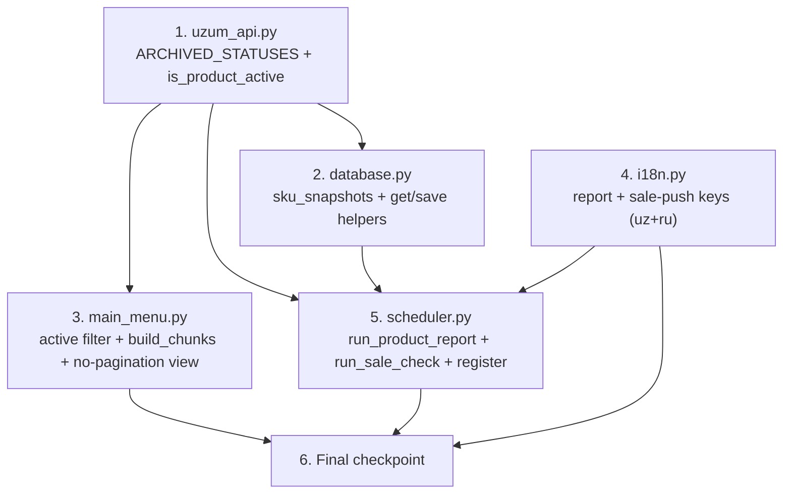

# Implementation Plan: Products Daily & Sale Notifications

## Overview

This plan implements three additive capabilities for the existing **Uzumchi** bot (Python,
aiogram 3, aiosqlite, APScheduler, `pytz` `Asia/Tashkent`): an active-only single-page products
view, a daily 09:00 product digest, and per-sale pushes derived from per-SKU quantity-decrease
detection. Implementation is **additive and non-destructive** and is scoped strictly to
`/projects/sandbox/Uzumchi`. The only files touched are `services/uzum_api.py`, `database.py`,
`handlers/main_menu.py`, `locales/i18n.py`, and `services/scheduler.py`.

Tasks are ordered by dependency (pure helper -> persistence -> view -> i18n -> scheduler) so that
each step builds on the previous and ends with the scheduler wiring everything together. No code is
written here — this is the plan only.

## Task Dependency Graph

**Dependency rationale:**
- **Task 1** (`is_product_active`) is the single source of truth for activeness and is consumed by
  both the view (Task 3) and the scheduler (Task 5); it has no dependencies, so it goes first.
- **Task 2** (`sku_snapshots`) is pure persistence and is consumed only by the sale check (Task 5).
- **Task 3** (view) depends on Task 1.
- **Task 4** (i18n) is independent but must precede Task 5, which renders using the new keys.
- **Task 5** (scheduler) depends on Tasks 1, 2, and 4 and wires the features together.
- **Task 6** is the final integration checkpoint.

## Tasks

- [x] 1. Add the active-product filter to `services/uzum_api.py`
  - [x] 1.1 Implement `ARCHIVED_STATUSES` and `is_product_active(p)`
    - In `/projects/sandbox/Uzumchi/services/uzum_api.py`, add module-level
      `ARCHIVED_STATUSES = {ARCHIVED, ARCHIVE, INACTIVE, DELETED, HIDDEN, MODERATION_FAILED}`
      and the pure helper `is_product_active(p: dict) -> bool` placed after `get_products`.
    - Inspect string fields `status`/`productStatus` (case-insensitive, `.strip().upper()`), then
      boolean flags `archived`/`isArchived` (`is True`) and `active`/`isActive` (`is False`);
      default to `True` (fail-open) when no recognized signal is present.
    - Add the documented tuning-note docstring; do not modify `get_products`,
      `_get_sku_variant_name`, or `calc_total_qty`.
    - _Requirements: 1.2, 1.3, 1.4_

  - [x]* 1.2 Write property test for active-filter signal handling
    - **Property 1: Active filter excludes all inactive shapes**
    - Generate product dicts with random combinations of status/flag fields (varied casing for the
      string statuses); assert `is_product_active` returns `False` iff any inactive signal is present.
    - **Validates: Requirements 1.2, 1.3**

  - [x]* 1.3 Write property test for fail-open default
    - **Property 2: Active filter default is fail-open**
    - Generate product dicts containing none of the inspected status/flag fields; assert
      `is_product_active` returns `True`.
    - **Validates: Requirements 1.4**

  - [x]* 1.4 Write unit tests for field shapes, casing, and flags
    - Table-driven examples covering `status`/`productStatus` string variants and casing, each
      boolean flag in isolation, absent fields, and mixed signals (one inactive signal wins).
    - _Requirements: 1.2, 1.3, 1.4_

- [x] 2. Add SKU snapshot persistence to `database.py`
  - [x] 2.1 Create the `sku_snapshots` table in `init_db`
    - In `/projects/sandbox/Uzumchi/database.py`, add a migration-safe
      `CREATE TABLE IF NOT EXISTS sku_snapshots (user_id, shop_id, sku_id TEXT, qty, updated_at, UNIQUE(user_id, shop_id, sku_id))`
      inside `init_db` before `commit`; do not alter or drop `users`, `notification_log`,
      `competitor_tracking`, or `product_urls`.
    - _Requirements: 7.1, 7.2, 10.1, 10.2_

  - [x] 2.2 Implement `get_sku_snapshots` and `save_sku_snapshots`
    - Add `get_sku_snapshots(user_id, shop_id) -> dict[str, int]` (returns `{}` when no rows) and
      `save_sku_snapshots(user_id, shop_id, mapping)` using
      `INSERT ... ON CONFLICT(user_id, shop_id, sku_id) DO UPDATE SET qty=excluded.qty, updated_at=strftime('%s','now')`;
      coerce `sku_id` to `str` and `qty` to `int`.
    - _Requirements: 7.3, 7.4_

  - [x]* 2.3 Write property test for snapshot upsert round-trip and idempotence
    - **Property 9: Snapshot upsert round-trip**
    - Over random `dict[str, int]` mappings against a temp/in-memory sqlite DB, assert
      `save_sku_snapshots` then `get_sku_snapshots` returns an equal mapping (keys `str`, values
      `int`), and that saving the same unchanged mapping repeatedly yields identical stored values.
    - **Validates: Requirements 7.5, 7.6**

  - [x]* 2.4 Write unit tests for empty-store behaviour
    - Assert `get_sku_snapshots` returns `{}` for a `(user_id, shop_id)` with no rows, and that two
      shops/users do not leak rows into each other's results.
    - _Requirements: 7.4_

- [x] 3. Rebuild the active-only single-page products view in `handlers/main_menu.py`
  - [x] 3.1 Add `build_chunks` and apply the active filter in `_show_products_page`
    - In `/projects/sandbox/Uzumchi/handlers/main_menu.py`, import `is_product_active`; in
      `_show_products_page`, fetch via `get_products`, set
      `active = [p for p in products if is_product_active(p)]`; if `active` is empty render the
      localized no-data message; otherwise build a header containing the active product count and
      total active quantity (`sum(calc_total_qty(p) for p in active)`).
    - Add `TG_CHUNK_LIMIT = 3500` and `build_chunks(header, blocks, limit)` that packs the header
      plus `format_product_skus(p, lang)` blocks into messages, preserving order and keeping each
      message `<= limit` (a single oversized block becomes its own message); remove
      `chunk_list`/`PRODUCTS_PER_PAGE` paging and the `products_nav_keyboard` call. Drop `page=1`
      from the `cmd_products` call site.
    - Send the first chunk via `_edit_or_answer(msg, ...)` and each subsequent chunk via
      `message.answer(...)` with NO `reply_markup`.
    - _Requirements: 1.1, 1.5, 1.6, 2.1, 2.2, 2.5, 2.6_

  - [x] 3.2 Neutralize stale pagination callbacks
    - Keep the `products_page_*` and `products_noop` handlers but make each
      `await callback.answer()` and re-render the single view (no error); leave
      `products_back`/`go_back`/`go_refresh` unchanged. Keep `products_nav_keyboard` in
      `utils/keyboards.py` (deprecated for this screen) so imports/tests do not break.
    - _Requirements: 2.7, 9.5_

  - [x]* 3.3 Write property test for chunking order preservation
    - **Property 3: Chunking loses no products**
    - Over random lists of string blocks, assert the ordered concatenation of all blocks across the
      chunks from `build_chunks` equals the ordered concatenation of the inputs (none dropped,
      duplicated, or reordered).
    - **Validates: Requirements 2.3**

  - [x]* 3.4 Write property test for chunk size bound
    - **Property 4: Chunk size bound**
    - Over random lists of string blocks, assert every produced chunk has length `<= TG_CHUNK_LIMIT`
      except a chunk consisting of a single block that itself exceeds the limit.
    - **Validates: Requirements 2.4**

  - [x]* 3.5 Write unit tests for no page buttons, active-only display, and empty case
    - **Property 5: Products view emits no page buttons**
    - With a mocked `get_products`: assert no message carries `products_page_*`/`products_noop`
      markup; assert only Active_Products appear (inactive ones excluded); assert an all-inactive or
      empty set renders the localized no-data message.
    - **Validates: Requirements 1.5, 1.6, 2.2**

- [x] 4. Add localization keys to `locales/i18n.py`
  - [x] 4.1 Add report and sale-push keys in uz + ru
    - In `/projects/sandbox/Uzumchi/locales/i18n.py`, add to `TEXTS` (both `uz` and `ru`):
      `product_report_title`, `product_report_body` (params `total_active`, `total_stock`,
      `low_count`, `out_count`), `product_report_item` (per low/out item line), `sale_push_title`,
      and `sale_push_item` (params `product`, `variant`, `sold`, `remaining`). Preserve all existing
      keys/values unchanged.
    - _Requirements: 8.1, 8.2, 8.3_

  - [x]* 4.2 Write tests for i18n totality and format safety
    - **Property 8 (localization totality)** — extend the existing `test_i18n.py` discipline: assert
      each new key resolves to a non-empty string in both uz and ru, and that formatting each key
      with its documented parameters produces a string with no unresolved `{` placeholders.
    - **Validates: Requirements 8.1, 8.2, 8.4**

- [x] 5. Add scheduled jobs and runners to `services/scheduler.py`
  - [x] 5.1 Implement `run_product_report(bot)`
    - In `/projects/sandbox/Uzumchi/services/scheduler.py`, import `is_product_active`; iterate
      `get_all_users`, guard each user with `was_notified_today(uid, "product_report")` (skip if
      already sent), fetch `get_products`, apply the active filter, compute total active count,
      total stock (`sum(calc_total_qty)`), Low_Stock (`<=5` and `>0`) and Out_Of_Stock (`==0`)
      counts plus a bounded list of urgent items, render via the new i18n keys, `send_message`, then
      `log_notification(uid, "product_report")`. Wrap each user in `try/except` and pace with
      `asyncio.sleep(...)`.
    - _Requirements: 3.2, 3.3, 3.4, 3.5, 3.6, 4.1, 4.2, 4.3, 4.4, 4.5, 4.6_

  - [x] 5.2 Implement `run_sale_check(bot)`
    - Import `_get_sku_variant_name`, `get_sku_snapshots`, `save_sku_snapshots`. Per user: fetch
      `get_products`, apply active filter, build `Current_Map` (`sku_id` coerced via `skuId` else
      `id`, skipping SKUs with neither), read `get_sku_snapshots`; if the stored snapshot is empty
      store the baseline and send no push; otherwise detect strict decreases and push one
      notification per sale with product title, variant (`_get_sku_variant_name`), `sold` (positive
      delta) and `remaining` (current qty); always `save_sku_snapshots` at the end of the pass. Wrap
      each user in `try/except` and pace with `asyncio.sleep(...)`.
    - _Requirements: 5.2, 5.3, 5.4, 5.5, 5.6, 5.7, 5.8, 5.9, 5.10, 6.1, 6.2_

  - [x] 5.3 Register both jobs in `start_scheduler`
    - Add `run_product_report` on `CronTrigger(hour=9, minute=0, timezone=TASHKENT)` id
      `"product_report_morning"` and `run_sale_check` on `IntervalTrigger(minutes=5)` id
      `"sale_check"`, both `replace_existing=True`, alongside (not replacing) the existing jobs
      (`morning_reports`, `storage_alerts`, `delivered_check`, `rating_check_*`, `forecast_check`,
      `returns_check`).
    - _Requirements: 3.1, 5.1, 9.8_

  - [x]* 5.4 Write property test for sale detection on strict decrease
    - **Property 6: Sale detection iff strict decrease**
    - Over random `prev`/`current` int maps, assert `detect_sales` emits `(sku_id, sold, remaining)`
      iff the SKU is in both maps with `prev[sku] > current[sku]`, where `sold == prev-current > 0`
      and `remaining == current[sku]`.
    - **Validates: Requirements 5.5, 5.6**

  - [x]* 5.5 Write property test for increases, new SKUs, and id-less SKUs
    - **Property 7: Increases and new SKUs never trigger a push** and
      **Property 10: SKUs without an id are skipped**
    - Over random snapshots and SKU dicts (some lacking `skuId`/`id`), assert no event is produced
      for new/unchanged/increased SKUs, and that id-less SKUs never enter the Current_Map or produce
      events.
    - **Validates: Requirements 5.4, 5.7**

  - [x]* 5.6 Write mocked-job test for sale-check first run and decrease
    - **Property 8: First run establishes baseline silently**
    - With a fake `bot` (records `send_message`), mocked `get_products`, and a temp DB: first run
      sends zero pushes and stores the baseline equal to the current active-SKU map; a second run
      with a decreased SKU sends exactly one push carrying the correct product/variant/sold/remaining;
      a second run with an increase sends zero pushes.
    - **Validates: Requirements 5.8, 5.9, 6.1**

  - [x]* 5.7 Write mocked-job tests for the daily report
    - **Property 11: Daily digest counts are consistent** and
      **Property 12: Daily report is sent at most once per day**
    - With a fake `bot`, mocked `get_products`, and a temp DB: assert digest total active / total
      stock / low / out counts match an independent recomputation over a fixed active set, and that
      a user already marked via `was_notified_today(uid, "product_report")` receives no second report.
    - **Validates: Requirements 3.3, 4.2, 4.3, 4.4**

- [x] 6. Final checkpoint - Ensure all tests pass
  - Ensure the full test suite (existing + new) passes, confirm no existing scheduler job, view, or
    i18n key was altered, and ask the user if questions arise.
  - _Requirements: 9.1, 9.2, 9.3, 9.4, 9.5, 9.6, 9.7, 9.8, 9.9, 10.1, 10.2, 10.3_

## Notes

- Tasks marked with `*` are optional (tests) and can be skipped for a faster MVP; core
  implementation tasks are never optional.
- Each task cites specific Uzumchi files, requirement sub-clauses, and (for test tasks) the design
  document property numbers for full traceability.
- Property-based tests run >= 100 iterations using Hypothesis (already present) and are tagged
  `Feature: products-daily-sale-notifications, Property {n}: {text}`.
- All work is scoped to `/projects/sandbox/Uzumchi`; no new third-party dependencies are introduced.
