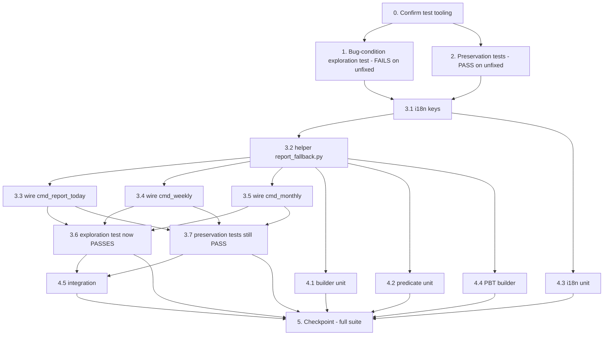

# Implementation Plan

> **Scope:** Every task below edits ONLY files under `/projects/sandbox/Uzumchi`.
> `/projects/sandbox/uzum_seller_bot` is **read-only reference** and MUST NOT be modified.
> Test framework: `pytest` (see `tests/conftest.py`, `tests/test_i18n.py`). Property-based
> tasks use `hypothesis` — see task 0 for the dev-dependency check.
>
> **Methodology reminder:**
> - Write the exploration test (task 1) and preservation tests (task 2) **BEFORE** implementing the fix.
> - Run task 1 on the **UNFIXED** code and confirm it **FAILS** — this proves the bug exists.
> - Run task 2 on the **UNFIXED** code and confirm it **PASSES** — this captures the baseline to preserve.
> - Do **not** start implementation (task 3) until tasks 1 and 2 are written, run, and their
>   outcomes documented.

- [x] 0. Confirm test tooling for the spec
  - Verify `pytest` runs the existing suite from `/projects/sandbox/Uzumchi` (`tests/conftest.py`
    already puts the project root on `sys.path`).
  - Confirm `hypothesis` is importable; if absent, add it as a dev/test dependency (e.g. install
    into the venv and note it in `requirements.txt` test section) so the property-based tasks
    (1, 2, 4.4) can run. Do NOT alter runtime deps used by the bot.
  - Decide the new test file names to be created under `/projects/sandbox/Uzumchi/tests/`:
    `test_report_fallback.py` (builder + predicate units + PBT) and
    `test_report_403_integration.py` (handler-level integration). No new source files yet.
  - _Supports: Testing Strategy (design) — Validation Approach_

- [x] 1. Write bug-condition exploration test (BEFORE the fix)
  - **Property 1: Bug Condition** - Product-based fallback on 403 orders
  - **CRITICAL**: This test MUST FAIL on the unfixed code — failure confirms the bug exists.
    **DO NOT fix the test or the code when it fails here.**
  - **GOAL**: Surface counterexamples showing daily/weekly/monthly reports render zeros and **no
    note** when orders come back `[]` (all-403) while products are readable.
  - File: create `tests/test_report_403_integration.py`. Drive the three report handlers with a
    fake aiogram `Message` (capture the text passed to `edit_text`/`answer`):
    - `cmd_report_today` (`handlers/main_menu.py`)
    - `cmd_weekly` and `cmd_monthly` (`handlers/analytics.py`)
  - Mocking (simulating the bug condition `isBugCondition` from design):
    - `get_fbs_orders` / `get_fbs_orders_period` (`services/uzum_api.py`) → return `[]`
    - `get_products` → realistic non-empty product list
    - `get_sales_stats_from_products` → non-empty stats with `total_sold > 0`,
      `total_returned`, `total_revenue`, `products_count > 0`, `low_stock_count`, `out_count`
  - **Scoped PBT approach**: scope to the concrete failing surfaces (daily, weekly, monthly) so the
    counterexample is reproducible; optionally use `hypothesis` to vary the product-stat values.
  - Assertions (encode the expected post-fix behavior — these will pass only after task 3):
    - Rendered text contains the approximate sold / returned / estimated-revenue figures
    - Rendered text contains the localized permission/approximate **note**
    - Rendered text does NOT present zeroed order totals as authoritative
  - Also add **edge case** (guards false trigger): `orders == []` AND
    `get_sales_stats_from_products` → `{}` (`products_count == 0`) ⇒ assert NO fallback note.
  - Run on **UNFIXED** code → **EXPECTED OUTCOME: FAIL** (reports show "Jami: 0 / Всего: 0",
    "0 so'm / 0 сум", no fallback summary, no note). Document the counterexamples observed.
  - Mark complete when the test is written, run, and the failure is documented.
  - _Requirements: 1.1, 1.2, 1.3, 1.4 (defect); validates target 2.1, 2.2, 2.3, 2.4_

- [x] 2. Write preservation tests (BEFORE the fix)
  - **Property 2: Preservation** - Order-present and non-bug paths unchanged
  - **IMPORTANT**: Follow observation-first methodology — observe outputs on **UNFIXED** code,
    then assert those exact outputs.
  - File: add to `tests/test_report_403_integration.py` (handler paths) and create
    `tests/test_report_fallback.py` for contract/predicate baselines.
  - 2.1 **Orders-present preservation**: mock `get_fbs_orders` / `get_fbs_orders_period` →
    non-empty order list; observe the full order-based render of `cmd_report_today`, `cmd_weekly`,
    `cmd_monthly` **including the conditional finance overlay** (commission, logistics, net profit,
    margin). Capture the exact text; assert no fallback note is injected. _(Req 3.1)_
  - 2.2 **Product-unavailable preservation**: `orders == []` AND `get_sales_stats_from_products`
    → `{}`; observe the existing zeroed report on unfixed code; assert no fallback / no note.
    _(Req 3.2, 3.6)_
  - 2.3 **Contract preservation**: assert the return shapes of `get_sales_stats_from_products`
    (`{total_sold, total_returned, total_revenue, low_stock_count, out_count, products_count}` or
    `{}`), `get_products`, and `get_fbs_orders` / `get_fbs_orders_period` (`[]` on all-403) are
    unchanged. _(Req 3.2)_
  - 2.4 **Buyurtmalar preservation**: assert `cmd_orders` (`handlers/main_menu.py`) rendering and
    its existing 403 product fallback + note are byte-identical before/after. _(Req 3.3)_
  - 2.5 **Untouched-features sanity**: confirm existing suites for finance overlay
    (`tests/test_finance.py`), scheduler (`tests/test_scheduler_delivered.py`), i18n
    (`tests/test_i18n.py`), and self-ping/health (`tests/test_self_ping.py`) still pass — covering
    finance overlay, Gemini, competitor monitor, multi-shop, SKU, charts, storage, `/ping` &
    `/health`. _(Req 3.4, 3.5)_
  - **Property-based** (preservation domain): with `hypothesis`, generate random non-empty order
    lists and assert the orders-present render path is identical before/after; generate the
    product-unavailable case and assert no fallback/note is emitted.
  - Run on **UNFIXED** code → **EXPECTED OUTCOME: PASS** (establishes the baseline to preserve).
  - Mark complete when the tests are written, run, and passing on unfixed code.
  - _Requirements: 3.1, 3.2, 3.3, 3.4, 3.5, 3.6_

- [x] 3. Fix: product-based fallback for daily/weekly/monthly reports on 403 orders

  - [x] 3.1 Add new i18n keys to `locales/i18n.py`
    - Add `report_fallback_summary` (uz + ru) — multi-line body with placeholders
      `{total_sold}`, `{total_returned}`, `{total_revenue}`, `{products_count}`,
      `{low_stock_count}`, `{out_count}` (formats per design example).
    - Add `report_fallback_note` (uz + ru) — the "orders/finance permission not granted; figures
      approximate, computed from product data" note.
    - **Do NOT** modify `t()` or any existing key in `TEXTS`.
    - _Bug_Condition: handler fallback branch needs shared localized strings_
    - _Expected_Behavior: localized note + summary (Property 1 / Req 2.4)_
    - _Preservation: existing keys + `t()` unchanged (Req 3.4)_
    - _Requirements: 2.4_

  - [x] 3.2 Create helper module `handlers/report_fallback.py`
    - `build_product_fallback_report(product_stats: dict, lang: str) -> str`: pure function that
      composes `t("report_fallback_summary", lang, **product_stats)` + `t("report_fallback_note", lang)`.
      Imports only `from locales.i18n import t`; no I/O, no project state.
    - `product_stats_available(stats: dict) -> bool`: returns
      `bool(stats) and stats.get("products_count", 0) > 0` (encodes `productStatsAvailable`).
    - No new subdirectories; single file under `handlers/`.
    - _Bug_Condition: isBugCondition uses `product_stats_available` guard_
    - _Expected_Behavior: build_product_fallback_report renders summary + note (Property 1)_
    - _Requirements: 2.1, 2.2, 2.3, 2.4_

  - [x] 3.3 Wire fallback into `cmd_report_today` (`handlers/main_menu.py`)
    - After `stats = summarize_orders(orders)` and the existing `get_products` fetch: when
      `stats["total"] == 0`, call `get_sales_stats_from_products(user["api_key"], user["shop_id"])`;
      if `product_stats_available(...)`, render daily header + `build_product_fallback_report(product_stats, lang)`
      + the existing low-stock / out-of-stock name lists, and **skip** the zeroed orders block and
      the finance overlay.
    - When `stats["total"] > 0` OR product stats unavailable → render exactly as today (unchanged).
    - Keep `get_products` inside the existing `try` so non-403 product failures still raise into the
      existing `except` (preserves Req 3.6).
    - _Bug_Condition: isBugCondition(daily) — orders empty AND product_stats_available_
    - _Expected_Behavior: expectedBehavior(result) — fallback summary + note_
    - _Preservation: orders-present + finance overlay path unchanged_
    - _Requirements: 2.1, 2.4, 3.1, 3.6_

  - [x] 3.4 Wire fallback into `cmd_weekly` (`handlers/analytics.py`)
    - After `orders = await get_fbs_orders_period(...)` + `stats = summarize_orders(orders)`: when
      `stats["total"] == 0`, fetch product stats; if available, render weekly header +
      `build_product_fallback_report(...)` and return — **instead of** the zeroed body, the all-zero
      daily chart, and the finance overlay.
    - Orders present → render exactly as today (body + finance overlay + daily chart).
    - _Bug_Condition: isBugCondition(weekly)_
    - _Expected_Behavior: fallback summary + note_
    - _Preservation: orders-present weekly render unchanged_
    - _Requirements: 2.2, 2.4, 3.1, 3.6_

  - [x] 3.5 Wire fallback into `cmd_monthly` (`handlers/analytics.py`)
    - Same pattern: when `stats["total"] == 0`, fetch product stats; if available, render monthly
      header + `build_product_fallback_report(...)` and return — **instead of** the zeroed body,
      weekly chart, expenses/profit block, and finance overlay. (`get_expenses` stays on the
      orders-present path only.)
    - Orders present → render exactly as today (unchanged).
    - _Bug_Condition: isBugCondition(monthly)_
    - _Expected_Behavior: fallback summary + note_
    - _Preservation: orders-present monthly render + `get_expenses` path unchanged_
    - _Requirements: 2.3, 2.4, 3.1, 3.6_

  - [x] 3.6 Verify the bug-condition exploration test now passes
    - **Property 1: Expected Behavior** - Product-based fallback on 403 orders
    - **IMPORTANT**: Re-run the SAME test from task 1 — do NOT write a new test.
    - Run the daily/weekly/monthly fallback assertions and the edge case from task 1.
    - **EXPECTED OUTCOME**: Test PASSES (confirms the bug is fixed; edge case still emits no note).
    - _Requirements: 2.1, 2.2, 2.3, 2.4_

  - [x] 3.7 Verify the preservation tests still pass
    - **Property 2: Preservation** - Order-present and non-bug paths unchanged
    - **IMPORTANT**: Re-run the SAME tests from task 2 — do NOT write new tests.
    - **EXPECTED OUTCOME**: All preservation tests PASS (no regressions): orders-present +
      finance overlay, product-unavailable, contracts, `cmd_orders`, and untouched-feature suites.
    - _Requirements: 3.1, 3.2, 3.3, 3.4, 3.5, 3.6_

- [x] 4. Add focused unit + property + integration coverage
  - [x] 4.1 Unit — builder: `build_product_fallback_report(product_stats, lang)` for
    `lang in {"uz", "ru"}` asserts all six figures (sold, returned, estimated revenue, product
    count, low-stock, out-of-stock) appear and the note is appended; revenue uses thousands
    separators. (`tests/test_report_fallback.py`) _(Req 2.4)_
  - [x] 4.2 Unit — predicate: `product_stats_available` is true for `{products_count: 5, ...}`,
    false for `{}` and for `{products_count: 0}`. _(encodes isBugCondition guard; Req 2.1-2.3)_
  - [x] 4.3 Unit — i18n keys: extend `tests/test_i18n.py` style to assert
    `report_fallback_summary` and `report_fallback_note` exist and format (no `[key]` fallback,
    no leftover `{}`) for both `uz` and `ru`; existing keys and `t()` unchanged. _(Req 2.4, 3.4)_
  - [x] 4.4 Property-based (`hypothesis`): random non-negative product-stat dicts ⇒
    `build_product_fallback_report` never raises and always includes the note + all six figures
    (Property 1 over builder domain). _(Req 2.4)_
  - [x] 4.5 Integration: all-403-orders + 200-products through each of `cmd_report_today`,
    `cmd_weekly`, `cmd_monthly` ⇒ captured payload contains fallback summary + note and no
    authoritative zeroed totals; orders-present ⇒ full report + finance overlay, no note;
    non-403 product failure (`get_sales_stats_from_products` → `{}`) ⇒ no fallback/note.
    (`tests/test_report_403_integration.py`) _(Req 2.1-2.4, 3.1, 3.6)_

- [x] 5. Checkpoint — Ensure all tests pass
  - Run the full suite from `/projects/sandbox/Uzumchi` (`pytest`). Confirm task 1 (now passing),
    task 2 (still passing), and task 4 all pass, and that `uzum_seller_bot` was never modified.
  - Ask the user if any questions arise.

---

## Task Dependency Graph

**Critical path:** 0 → 1/2 → 3.1 → 3.2 → 3.3/3.4/3.5 → 3.6/3.7 → 4.5 → 5
