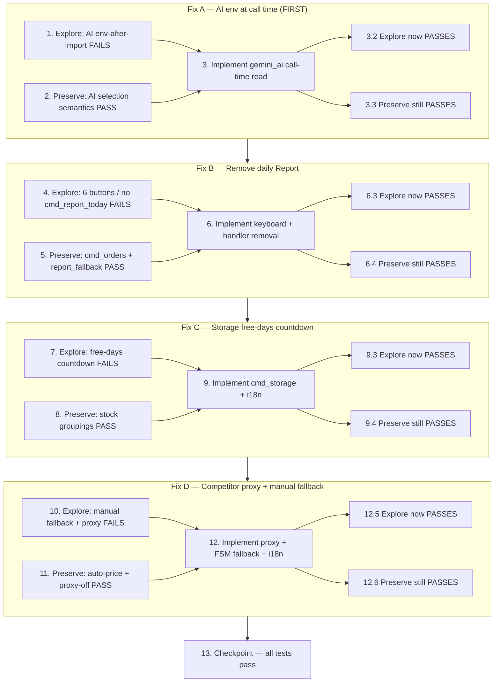

# Implementation Plan

> Scope: **strictly `/projects/sandbox/Uzumchi`**. `uzum_seller_bot` is read-only reference and MUST NOT be modified.
>
> Methodology (per fix): **Explore** (write a failing exploration test on UNFIXED code) → **Preserve**
> (write/confirm preservation tests that PASS on UNFIXED code) → **Implement** the fix → **Validate**
> (the same exploration test now passes, preservation tests still pass).
>
> **CRITICAL reminders for every fix below:**
> - Write the exploration test BEFORE implementing the fix.
> - Run the exploration test on the UNFIXED code first — it MUST FAIL (this confirms the bug exists). Do NOT "fix" the test when it fails.
> - Follow the observation-first methodology for preservation tests: observe UNFIXED behavior, then assert it.
>
> The four fixes are ordered by dependency/value as requested: **Fix 4 (AI) first** (smallest, highest value),
> then **Fix 2 (menu)**, **Fix 1 (storage)**, **Fix 3 (competitor)**. Fixes are independent; this order
> minimizes risk and front-loads value.

---

## Fix A — AI env read at call time (do first)

Files: `services/gemini_ai.py`, `tests/test_ai_providers.py`.

- [x] 1. Write bug condition exploration test for AI env-read-at-call-time
  - **Property 4: Bug Condition** - AI Reads Env At Call Time
  - **CRITICAL**: This test MUST FAIL on unfixed code — failure confirms the bug exists. DO NOT fix the test or code when it fails.
  - **NOTE**: This test encodes the expected behavior — it will validate the fix when it passes after implementation.
  - **GOAL**: Surface the counterexample that provider keys present in the environment are ignored because they were read at import time.
  - **Scoped approach** (deterministic, env-driven bug): in `tests/test_ai_providers.py`, clear all provider env vars (`GROQ_API_KEY`, `OPENROUTER_API_KEY`, `GEMINI_API_KEY`, `AI_PROVIDER`) via `monkeypatch.delenv(..., raising=False)`, import/reload `services.gemini_ai`, THEN set `monkeypatch.setenv("GROQ_API_KEY", "x")` *after* import, and assert `_select_providers()` is non-empty (returns `["groq"]`).
  - Run on UNFIXED `services/gemini_ai.py` (module-level constants captured `""` at import).
  - **EXPECTED OUTCOME**: Test FAILS (selection is empty despite the populated env) — proves the bug exists.
  - Document the counterexample (e.g. "GROQ_API_KEY set after import → _select_providers() == [] instead of ['groq']").
  - _Requirements: 1.8, 1.9_

- [x] 2. Write preservation tests for AI provider-selection semantics (BEFORE implementing fix)
  - **Property 5: Preservation** - AI Selection Semantics Unchanged
  - **IMPORTANT**: Follow observation-first methodology — observe behavior on UNFIXED code, then assert it.
  - Retarget existing `tests/test_ai_providers.py` cases from `monkeypatch.setattr(g, "GROQ_API_KEY", ...)` to env-based `monkeypatch.setenv(...)` / `monkeypatch.delenv(..., raising=False)` for all keys and `AI_PROVIDER` — set env BEFORE the relevant call so they pass on UNFIXED code where the import-time read still sees them.
  - Confirm assertions remain: ordering (Groq → OpenRouter → Gemini), `AI_PROVIDER` override, no-key localized "AI not configured" message, cross-provider fallback dispatch, and that `ask_gemini` / `build_*_prompt` names stay call-site compatible.
  - Run on UNFIXED code.
  - **EXPECTED OUTCOME**: Tests PASS (baseline semantics to preserve).
  - _Requirements: 3.8, 3.10_

- [x] 3. Fix AI env read at call time in `services/gemini_ai.py`

  - [x] 3.1 Move provider env reads from import-time constants to call-time
    - In `services/gemini_ai.py`, remove the module-level constant assignments `GROQ_API_KEY`, `OPENROUTER_API_KEY`, `GEMINI_API_KEY`, `AI_PROVIDER`, `GROQ_MODEL`, `OPENROUTER_MODEL`, `GEMINI_MODEL`.
    - Inside `_all_providers()`, read keys/models lazily via `os.getenv` at call time (`groq_key`, `or_key`, `gem_key`, `groq_model="llama-3.3-70b-versatile"`, `or_model="meta-llama/llama-3.3-70b-instruct"`, `gem_model="gemini-1.5-flash"`) and build the `ProviderConfig`s from these locals; keep the Groq endpoint `https://api.groq.com/openai/v1/chat/completions`.
    - In `_select_providers()`, read `AI_PROVIDER` at call time: `os.getenv("AI_PROVIDER", "").strip().lower()`; keep ordering/override/empty-list logic unchanged.
    - Leave `ask_gemini`, `_call_openai_compatible`, `_call_gemini`, the prompt builders, and `SSL_CONTEXT` unchanged.
    - Optional defense-in-depth: add an idempotent `load_dotenv()` near the top of `gemini_ai.py`.
    - _Bug_Condition: C4 — isBugCondition where provider key present but env read at import time before load_dotenv_
    - _Expected_Behavior: `_all_providers()`/`_select_providers()` read env at call time; `ask_gemini` returns a real completion_
    - _Preservation: AI selection ordering/override/no-key message/fallback and prompt-builder + `ask_gemini` signatures_
    - _Requirements: 2.8, 2.9_

  - [x] 3.2 Verify the AI exploration test now passes
    - **Property 4: Expected Behavior** - AI Reads Env At Call Time
    - **IMPORTANT**: Re-run the SAME test from task 1 — do NOT write a new test.
    - Also verify `ask_gemini` returns a real answer (not the "not configured" message) with a stubbed `_call_openai_compatible`, and that `AI_PROVIDER` override is read at call time.
    - **EXPECTED OUTCOME**: Test PASSES (confirms env is read at call time / bug fixed).
    - _Requirements: 2.8, 2.9_

  - [x] 3.3 Verify AI preservation tests still pass
    - **Property 5: Preservation** - AI Selection Semantics Unchanged
    - **IMPORTANT**: Re-run the SAME (env-retargeted) tests from task 2 — do NOT write new tests.
    - **EXPECTED OUTCOME**: Tests PASS (no regressions in ordering/override/no-key/fallback).
    - _Requirements: 3.8, 3.10_

---

## Fix B — Remove daily Report

Files: `utils/keyboards.py`, `handlers/main_menu.py`; tests `tests/test_menu_keyboard.py`, `tests/test_report_403_integration.py`.

- [x] 4. Write bug condition exploration test for daily Report removal
  - **Property 2: Bug Condition** - Daily Report Removed
  - **CRITICAL**: This test MUST FAIL on unfixed code — failure confirms the bug exists. DO NOT fix the test or code when it fails.
  - **NOTE**: This test encodes the expected behavior — it will validate the fix when it passes after implementation.
  - **GOAL**: Surface the counterexample that the menu still renders a Report button and `cmd_report_today` still exists.
  - **Scoped approach** (deterministic): in `tests/test_menu_keyboard.py`, assert `main_menu_keyboard("ru")` and `main_menu_keyboard("uz")` each yield exactly 6 buttons (Products, Orders, Storage, Competitor, AI, Settings), the layout sums to 6, no report/weekly/monthly/returns label appears, and `not hasattr(handlers.main_menu, "cmd_report_today")`.
  - Run on UNFIXED code.
  - **EXPECTED OUTCOME**: Test FAILS (7 buttons incl. `📊 Отчёт`/`📊 Hisobot`; `cmd_report_today` present).
  - Document the counterexample.
  - _Requirements: 1.3, 1.4_

- [x] 5. Write preservation tests for retained menu + orders behavior (BEFORE implementing fix)
  - **Property 5: Preservation** - Retained Menu/Orders Behavior Unchanged
  - **IMPORTANT**: Follow observation-first methodology.
  - In `tests/test_report_403_integration.py`, remove the three `mm.cmd_report_today`-driven daily-report cases (and the daily-only sample wiring), documenting the removal in the test docstring; retain/retarget the orders-present and non-403 preservation intent onto `cmd_orders` (inline product-based 403 fallback) so it still passes on UNFIXED code.
  - Confirm `tests/test_report_fallback.py` (builder/predicate/i18n/PBT) still passes — `report_fallback.py` is intentionally KEPT.
  - Run on UNFIXED code.
  - **EXPECTED OUTCOME**: Tests PASS (baseline `cmd_orders` + `report_fallback` behavior to preserve).
  - _Requirements: 3.1, 3.2, 3.10_

- [x] 6. Fix — remove daily Report button and handler

  - [x] 6.1 Remove the Report button from the keyboard
    - In `utils/keyboards.py::main_menu_keyboard`, remove the `builder.button(text=t("btn_report", lang))` line; keep Products, Orders, Storage, Competitor, AI, Settings (6 buttons, order preserved).
    - Change layout to `builder.adjust(2, 2, 2)`; keep signature `(lang: str = "ru") -> ReplyKeyboardMarkup` and `resize_keyboard=True`.
    - Leave `btn_report`/`btn_weekly`/`btn_monthly`/`btn_returns` keys in `i18n.py` (harmless unused).
    - _Bug_Condition: C2 — report button present in main_menu_keyboard_
    - _Expected_Behavior: keyboard emits exactly six buttons, no Report/weekly/monthly/returns_
    - _Preservation: keyboard signature, resize_keyboard, retained button labels_
    - _Requirements: 2.3_

  - [x] 6.2 Delete `cmd_report_today` handler and dead import
    - In `handlers/main_menu.py`, delete the entire `cmd_report_today` handler (`@router.message(F.text.in_(["📊 Hisobot", "📊 Отчёт"]))` block) and its `# ─── Bugungi hisobot ───` section.
    - Remove the now-unused import `from handlers.report_fallback import (build_product_fallback_report, product_stats_available)` (verified: `cmd_orders` builds its 403 fallback inline and does not use these symbols).
    - KEEP `handlers/report_fallback.py` (pure, separately tested utility).
    - _Bug_Condition: C2 — cmd_report_today handler reachable_
    - _Expected_Behavior: no `cmd_report_today` handler for `📊 Hisobot`/`📊 Отчёт`; dead report wiring removed_
    - _Preservation: `cmd_orders` inline 403 fallback and `report_fallback.py` retained_
    - _Requirements: 2.4_

  - [x] 6.3 Verify the menu exploration test now passes
    - **Property 2: Expected Behavior** - Daily Report Removed
    - **IMPORTANT**: Re-run the SAME test from task 4 — do NOT write a new test.
    - **EXPECTED OUTCOME**: Test PASSES (6 buttons, no Report, `cmd_report_today` absent).
    - _Requirements: 2.3, 2.4_

  - [x] 6.4 Verify menu/orders preservation tests still pass
    - **Property 5: Preservation** - Retained Menu/Orders Behavior Unchanged
    - **IMPORTANT**: Re-run the SAME tests from task 5 — do NOT write new tests.
    - **EXPECTED OUTCOME**: Tests PASS (`cmd_orders` + `report_fallback` unaffected).
    - _Requirements: 3.1, 3.2, 3.10_

---

## Fix C — Storage free-days countdown

Files: `handlers/main_menu.py` (`cmd_storage`), `locales/i18n.py`; reuses `services/uzum_api.py::get_invoices` and `services/storage_tracker.py` (`parse_invoices`, `get_storage_alerts`, `FREE_DAYS`).

- [x] 7. Write bug condition exploration test for storage free-days countdown
  - **Property 1: Bug Condition** - Storage Free-Days Countdown
  - **CRITICAL**: This test MUST FAIL on unfixed code — failure confirms the bug exists. DO NOT fix the test or code when it fails.
  - **NOTE**: This test encodes the expected behavior — it will validate the fix when it passes after implementation.
  - **GOAL**: Surface the counterexample that `cmd_storage` shows no free-days countdown even when invoices are computable.
  - **Scoped PBT/example approach** (concrete invoices for reproducibility): mock `get_invoices` to return two ACCEPTED invoices (43 and 58 days stored) and assert the text `cmd_storage` renders contains the computed `free_days_left = max(0, 60 - days_stored)` values (`17` and `2`) and flags the near-limit (58-day) item.
  - Run on UNFIXED code.
  - **EXPECTED OUTCOME**: Test FAILS (only stock groupings render; no free-days section).
  - Document the counterexample.
  - _Requirements: 1.1, 1.2_

- [x] 8. Write preservation test for storage stock groupings (BEFORE implementing fix)
  - **Property 5: Preservation** - Storage Stock View Unchanged
  - **IMPORTANT**: Follow observation-first methodology — observe the UNFIXED stock-view output, then assert it.
  - Add a test asserting the existing out/low/warn/ok stock groupings render identically (the free-days section will be additive, not a replacement).
  - Run on UNFIXED code.
  - **EXPECTED OUTCOME**: Test PASSES (baseline stock view to preserve).
  - _Requirements: 3.1, 3.10_

- [x] 9. Fix — add storage free-days countdown to `cmd_storage`

  - [x] 9.1 Add free-storage i18n keys (uz+ru)
    - In `locales/i18n.py`, add `storage_free_header`, `storage_free_item`, `storage_free_summary`, and `storage_free_unavailable` for both uz and ru, without modifying `t()` or any existing key.
    - _Requirements: 2.1, 2.2_

  - [x] 9.2 Render the free-storage section in `cmd_storage`
    - In `handlers/main_menu.py::cmd_storage`, add module-level imports `from services.uzum_api import get_invoices` and `from services.storage_tracker import parse_invoices, get_storage_alerts, FREE_DAYS`.
    - Fetch defensively inside the existing `try`: `invoices = await get_invoices(user["api_key"], user["shop_id"])`; `items = parse_invoices(invoices)`.
    - When `items` non-empty: build an additive free-storage section — use `get_storage_alerts(items)`, compute the minimum remaining free days `min(max(0, FREE_DAYS - it.days_stored) for it in items)` and the count of at-risk items (paid+alert+warn), list up to ~5 most-urgent invoices (highest `days_stored` first) as localized lines with icons (💸/🚨/⚠️/✅) — prepend/append to the existing stock `text`.
    - When `items` empty / invoices `[]` / 403: append the localized `storage_free_unavailable` note under the stock view; no crash, stock groupings unchanged.
    - _Bug_Condition: C1 — storage view open, invoices computable, free-days section not rendered_
    - _Expected_Behavior: render `free_days_left = max(0, FREE_DAYS - days_stored)` per invoice/summary; empty/403 → stock view + unavailable note, no crash_
    - _Preservation: existing out/low/warn/ok stock groupings emitted exactly as before (additive)_
    - _Requirements: 2.1, 2.2_

  - [x] 9.3 Verify the storage exploration test now passes
    - **Property 1: Expected Behavior** - Storage Free-Days Countdown
    - **IMPORTANT**: Re-run the SAME test from task 7 — do NOT write a new test.
    - Also assert the `get_invoices -> []` path renders the stock view + `storage_free_unavailable` note without raising.
    - **EXPECTED OUTCOME**: Test PASSES (free-days values 17/2 shown; near-limit flagged; empty path safe).
    - _Requirements: 2.1, 2.2_

  - [x] 9.4 Verify storage preservation test still passes
    - **Property 5: Preservation** - Storage Stock View Unchanged
    - **IMPORTANT**: Re-run the SAME test from task 8 — do NOT write a new test.
    - **EXPECTED OUTCOME**: Test PASSES (stock groupings unchanged after the additive section).
    - _Requirements: 3.1, 3.10_

---

## Fix D — Competitor price: proxy + manual fallback

Files: `services/competitor_monitor.py`, `handlers/main_menu.py`, `locales/i18n.py`, `.env.example`; tests `tests/test_competitor_price.py` (preservation) and new cases.

- [x] 10. Write bug condition exploration test for competitor manual fallback + proxy
  - **Property 3: Bug Condition** - Competitor Price Always Shown
  - **CRITICAL**: This test MUST FAIL on unfixed code — failure confirms the bug exists. DO NOT fix the test or code when it fails.
  - **NOTE**: This test encodes the expected behavior — it will validate the fix when it passes after implementation.
  - **GOAL**: Surface the counterexamples that (a) a blocked auto-fetch dead-ends the user and (b) `UZUM_PROXY` is never passed to the aiohttp GETs.
  - **Scoped approach**: drive `competitor_url_received` with `get_product_info_by_url` mocked to return `price_source == "none"` and assert the bot transitions to `CompetitorStates.waiting_manual_price` and sends the manual-entry prompt. Separately, monkeypatch `UZUM_PROXY` and stub the aiohttp session, asserting `session.get` receives `proxy="<value>"` in `_fetch_product_html` and `_get_product_from_api`.
  - Run on UNFIXED code.
  - **EXPECTED OUTCOME**: Test FAILS (no `waiting_manual_price` state/handler; `proxy=` never forwarded).
  - Document the counterexamples.
  - _Requirements: 1.5, 1.6, 1.7_

- [x] 11. Write preservation tests for competitor auto-price path + proxy-off equivalence (BEFORE implementing fix)
  - **Property 5: Preservation** - Competitor Auto-Price Path Unchanged
  - **IMPORTANT**: Follow observation-first methodology.
  - Assert that when `get_product_info_by_url` returns `price_source` in `{"api","html"}` with `min_price > 0`, `competitor_url_received` renders `format_single_product_report` and clears state exactly as today (manual fallback NOT triggered); confirm existing `tests/test_competitor_price.py` Property 6/7 still pass and `get_product_info_by_url` / `format_single_product_report` / `check_saved_urls` signatures are unchanged.
  - Assert proxy-off equivalence: with `UZUM_PROXY` unset, the GET helpers behave as today (`proxy=None`).
  - Run on UNFIXED code.
  - **EXPECTED OUTCOME**: Tests PASS (baseline auto-price + proxy-off behavior to preserve).
  - _Requirements: 3.9, 3.10_

- [x] 12. Fix — competitor proxy support + manual-price fallback

  - [x] 12.1 Add call-time `UZUM_PROXY` support in `competitor_monitor` + document `.env.example`
    - In `services/competitor_monitor.py`, `import os` at top; in `_fetch_product_html(url)` and `_get_product_from_api(product_id)` read `proxy = os.getenv("UZUM_PROXY", "") or None` at call time and pass `proxy=proxy` to each `session.get(...)`. No signature changes.
    - Add `UZUM_PROXY=` (with an explanatory comment, no secrets) to `.env.example`.
    - _Bug_Condition: C3 — no outbound proxy configuration for blocked cloud IPs_
    - _Expected_Behavior: when `UZUM_PROXY` set, GETs route through it; `proxy=None` when unset_
    - _Preservation: proxy-off equivalence; `get_product_info_by_url`/`check_saved_urls` unchanged_
    - _Requirements: 2.5_

  - [x] 12.2 Add manual-price fallback FSM flow in `competitor_url_received`
    - In `handlers/main_menu.py`, add `waiting_manual_price = State()` to `CompetitorStates`.
    - In `competitor_url_received`, after `get_product_info_by_url` + `add_product_url` save + `my_price` lookup: if auto price found (`price_source in {"api","html"}` and `min_price > 0`) render `format_single_product_report(...)` and `state.clear()` (preservation path); else store `pending_name`/`pending_url`/`my_price` in FSM data, set `CompetitorStates.waiting_manual_price`, and send the localized blocked-note + manual prompt (do NOT clear state).
    - _Bug_Condition: C3 — pasted URL, auto price none, no manual fallback offered_
    - _Expected_Behavior: prompt for manual price when auto fetch returns no price_
    - _Preservation: auto-price path renders + clears exactly as before when price found_
    - _Requirements: 2.6, 2.7_

  - [x] 12.3 Add the `waiting_manual_price` handler (parse, save, render)
    - In `handlers/main_menu.py`, add `@router.message(CompetitorStates.waiting_manual_price)`: parse the number from `message.text` (strip separators; reject non-numeric or `<= 0` with localized `competitor_manual_invalid` re-prompt, staying in state); read FSM data; persist via `add_product_url(user_id, shop_id, product_name=pending_name, uzum_url=pending_url)`; build `info = {"title": pending_name, "min_price": manual_price, "max_price": manual_price, "price_source": "manual", "html_only": False, "shop": "—", "rating": 0, "reviews": 0}` and render `format_single_product_report(pending_name, my_price, info, lang)`; then `state.clear()`. Handle `🔙 Назад / 🔙 Orqaga` cancel the same way `competitor_url_received` does.
    - _Bug_Condition: C3 — user dead-ended with no comparison result_
    - _Expected_Behavior: save entered price via `add_product_url` and render `format_single_product_report` with it as the competitor price_
    - _Preservation: `format_single_product_report` signature unchanged; invalid input re-prompts and stays in state_
    - _Requirements: 2.6_

  - [x] 12.4 Add competitor i18n keys (uz+ru)
    - In `locales/i18n.py`, add `competitor_blocked_note`, `competitor_manual_prompt`, and `competitor_manual_invalid` for both uz and ru, without modifying `t()` or existing keys.
    - _Requirements: 2.6, 2.7_

  - [x] 12.5 Verify the competitor exploration test now passes
    - **Property 3: Expected Behavior** - Competitor Price Always Shown
    - **IMPORTANT**: Re-run the SAME test from task 10 — do NOT write a new test.
    - Also drive the new `waiting_manual_price` handler with a numeric message and assert `add_product_url` is called and `format_single_product_report` is rendered with the entered value as the competitor (min/max) price; assert a non-numeric input re-prompts and stays in state; assert `proxy="<value>"` is forwarded in both GET helpers when `UZUM_PROXY` is set.
    - **EXPECTED OUTCOME**: Test PASSES (manual fallback + proxy forwarding work; bug fixed).
    - _Requirements: 2.5, 2.6, 2.7_

  - [x] 12.6 Verify competitor preservation tests still pass
    - **Property 5: Preservation** - Competitor Auto-Price Path Unchanged
    - **IMPORTANT**: Re-run the SAME tests from task 11 — do NOT write new tests.
    - **EXPECTED OUTCOME**: Tests PASS (auto-price path, proxy-off equivalence, and kept signatures unchanged).
    - _Requirements: 3.9, 3.10_

---

- [x] 13. Checkpoint - Ensure all tests pass
  - Run the full `Uzumchi` test suite and confirm all four exploration tests now pass, all preservation tests still pass, and no regressions were introduced. Ask the user if questions arise.
  - Confirm `uzum_seller_bot` was not modified.

---

## Task Dependency Graph

**Notes on the graph:**
- Within each fix, the **exploration** and **preservation** tests are independent of each other but both
  gate the **implementation**; the implementation then gates its own verify sub-tasks.
- Across fixes, the ordering A → B → C → D is by dependency/value (AI first: smallest, highest value).
  The four fixes touch mostly distinct code paths and could be parallelized, but the linear order keeps
  validation simple and front-loads value. The final Checkpoint (13) depends on all four fixes.
