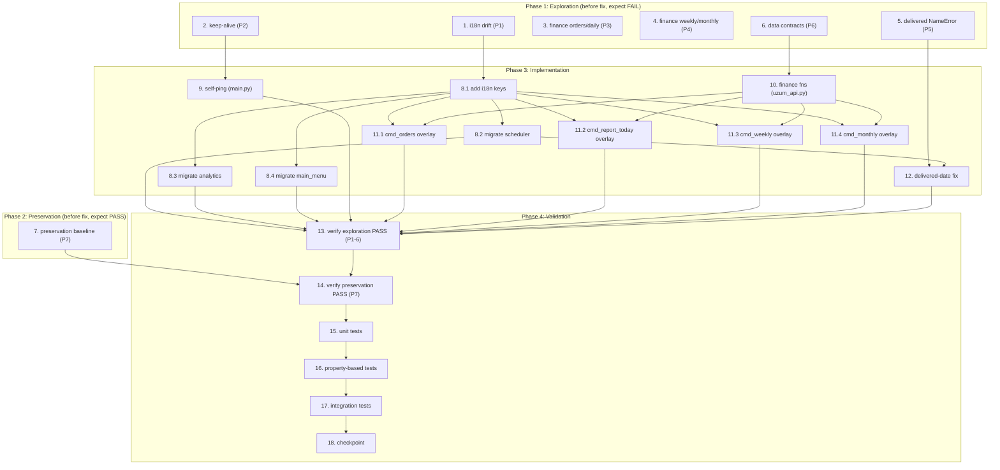

# Implementation Plan

> **Scope guardrail (read first):** Every implementation and test task below targets files
> inside `/projects/sandbox/Uzumchi` **only**. The reference repo
> `/projects/sandbox/uzum_seller_bot` is **read-only** — consult it for behavior to port
> (self-ping loop, finance-order parsing, delivered text) but **never edit it**.
>
> **Methodology (bugfix / bug-condition):**
> 1. **Explore** — write bug-condition tests and run them on the **UNFIXED** Uzumchi tree.
>    They are expected to **FAIL** (or, for the data-contract checks, to pin the contracts
>    the merge must not break). Failure confirms the defect exists. **Do not fix anything
>    while writing exploration tests.**
> 2. **Preserve** — observe behavior of the advanced features / existing contracts on the
>    **UNFIXED** tree and write property tests that **PASS** on it (baseline to protect).
> 3. **Implement** — apply the additive fix.
> 4. **Validate** — re-run the same tests; exploration tests now PASS, preservation tests
>    still PASS, then add unit / property-based / integration coverage.
>
> Suggested test layout (new, additive): `Uzumchi/tests/` with
> `test_exploration.py`, `test_preservation.py`, `test_finance.py`, `test_i18n.py`,
> `test_scheduler_delivered.py`, `test_self_ping.py`, `test_integration_reports.py`.
> Recommend `pytest` + `hypothesis` for property-based tests.

---

## Phase 1 — Exploratory bug-condition tests (write & run BEFORE any fix)

- [ ] 1. Write i18n-drift exploration test
  - **Property 1: Bug Condition** - Centralized i18n for scheduler and report strings
  - **CRITICAL**: This test MUST FAIL on unfixed code — failure confirms the drift exists.
    **Do NOT fix the code or the test when it fails.**
  - **GOAL**: Surface counterexamples that demonstrate scheduler/report strings are NOT
    sourced from the central catalog.
  - **Scoped approach**: Assert that `locales/i18n.py::TEXTS` does NOT yet contain the new
    finance/scheduler/report keys named in the design (e.g. `sched_morning_body`,
    `sched_storage_line`, `sched_delivered`, `report_weekly_body`, `report_monthly_body`,
    `finance_commission`, `finance_logistics`, `finance_net_profit`, `finance_margin`).
  - Assert that the source files still build text from inline `if lang == "uz"` blocks:
    grep `services/scheduler.py` (`run_morning_reports`, `run_storage_alerts`,
    `run_delivered_check`, `run_rating_check`, `run_forecast_check`, `run_returns_check`),
    `handlers/analytics.py` (`cmd_weekly`, `cmd_monthly`), and
    `handlers/main_menu.py` (`cmd_orders`, `cmd_report_today`) for `if lang ==` occurrences.
  - **EXPECTED OUTCOME**: Test FAILS / confirms drift (keys missing + inline blocks present).
  - Document counterexamples found (which keys are missing, which functions hold inline copy).
  - _Files: locales/i18n.py, services/scheduler.py, handlers/analytics.py, handlers/main_menu.py_
  - _Requirements: 1.1_

- [ ] 2. Write Render keep-alive exploration test
  - **Property 2: Bug Condition** - Render self-ping keep-alive
  - **CRITICAL**: This test MUST FAIL on unfixed code — failure confirms the gap.
  - **GOAL**: Demonstrate `Uzumchi/main.py` neither reads `RENDER_EXTERNAL_URL` nor
    schedules a background ping task.
  - Assert `main.py` source contains no `self_ping` coroutine, no
    `asyncio.create_task(self_ping())`, and no reference to `RENDER_EXTERNAL_URL`.
  - Assert `main.py` imports only `from aiohttp import web` (no `aiohttp` client import).
  - **EXPECTED OUTCOME**: Test FAILS / confirms there is no keep-alive task.
  - Document counterexamples found.
  - _Files: main.py_
  - _Requirements: 1.2_

- [ ] 3. Write finance-detail exploration test for Orders and daily report
  - **Property 3: Bug Condition** - Finance detail in Orders and daily report
  - **CRITICAL**: This test MUST FAIL on unfixed code — failure confirms the omission.
  - **GOAL**: Feed a representative `/v1/finance/orders` payload (with `commission`,
    `sellerProfit`, `logisticDeliveryFee`, `sellPrice`, `dateIssued`) and show that the
    current Orders / daily report text contains **no** commission or seller-profit tokens.
  - Render `handlers/main_menu.py::cmd_orders` and `cmd_report_today` against a fake bot +
    fake API and assert the produced text has no commission/seller-profit lines.
  - Also assert there is no `summarize_finance_orders` / `parse_finance_order` /
    `extract_finance_orders` symbol in `services/uzum_api.py` yet.
  - **EXPECTED OUTCOME**: Test FAILS / confirms finance detail is absent.
  - Document counterexamples found.
  - _Files: handlers/main_menu.py, services/uzum_api.py_
  - _Requirements: 1.3_

- [ ] 4. Write finance-aggregate & margin exploration test for weekly/monthly reports
  - **Property 4: Bug Condition** - Finance aggregates and margin in weekly/monthly reports
  - **CRITICAL**: This test MUST FAIL on unfixed code — failure confirms the omission.
  - **GOAL**: Show `cmd_weekly` and `cmd_monthly` render counts + revenue (and a coarse
    `get_expenses` figure for monthly) but **no** aggregate commission, logistics, net
    profit, or profit-margin (rentabellik) `%`.
  - Render `handlers/analytics.py::cmd_weekly` and `cmd_monthly` against a fake bot + fake
    API returning a finance payload; assert no commission/logistics/net-profit/margin tokens.
  - **EXPECTED OUTCOME**: Test FAILS / confirms aggregates + margin are absent.
  - Document counterexamples found.
  - _Files: handlers/analytics.py, services/uzum_api.py_
  - _Requirements: 1.4, 1.5_

- [ ] 5. Write delivered-date NameError exploration test (edge case)
  - **Property 5: Bug Condition** - Delivered date formatting without NameError
  - **CRITICAL**: This test MUST FAIL (raise) — failure confirms the latent defect we must
    NOT carry over from the reference bot.
  - **GOAL**: In a scratch harness, reproduce the reference `check_delivered_orders` line
    that calls `ms_to_date(o['date_issued'])` while only `ms_to_date_str` is imported, and
    assert it raises `NameError: ms_to_date`.
  - Separately assert that Uzumchi already exposes the correct helper
    `utils/helpers.py::format_date(ts_ms)` (so the fix has a defined, imported target) and
    that `services/scheduler.py` does NOT (yet) reference `ms_to_date`.
  - **EXPECTED OUTCOME**: Scratch port raises `NameError`; `format_date` exists.
  - Document counterexample: `NameError: name 'ms_to_date' is not defined`.
  - _Files: services/scheduler.py, utils/helpers.py (read-only reference for the harness: uzum_seller_bot/services/scheduler.py)_
  - _Requirements: 1.6_

- [ ] 6. Write data-layer contract-divergence exploration test
  - **Property 6: Bug Condition** - Data-layer reconciliation
  - **CRITICAL**: This test pins the Uzumchi contracts the merge must not break. It MUST
    PASS on unfixed code (capturing today's shapes) and is re-run after the fix to prove the
    contracts are unchanged.
  - **GOAL**: Establish the contracts that a naive merge would violate.
  - Assert `services/uzum_api.py::get_products(api_key, shop_id)` returns a `list` (raw
    `list[dict]`), NOT a dict, and that no `extract_products` / `parse_product` symbol is in
    any Uzumchi consumer path.
  - Assert `get_finance_orders` signature is keyword `date_from=` (not positional `shop_id`)
    via `inspect.signature`.
  - Assert `summarize_orders` returns the 6-key dict
    `{total, delivered, cancelled, processing, shipped, revenue}` and
    `storage_tracker.parse_invoices` returns `StorageItem` instances.
  - **EXPECTED OUTCOME**: Contracts captured (test PASSES on unfixed tree).
  - Document the captured signatures/shapes as the baseline to preserve.
  - _Files: services/uzum_api.py, services/storage_tracker.py_
  - _Requirements: 1.7_

---

## Phase 2 — Preservation tests (write & run BEFORE any fix; must PASS on unfixed code)

- [ ] 7. Write preservation property tests for advanced features & existing contracts
  - **Property 7: Preservation** - Advanced features and existing contracts unchanged
  - **IMPORTANT**: Follow the observation-first methodology — run the UNFIXED Uzumchi tree,
    record actual outputs, then write property-based tests that assert those outputs across
    the input domain. Tests MUST PASS on unfixed code (this is the baseline to protect).
  - Observe & capture (golden/serialized) on unfixed code:
    - `services/gemini_ai.py`: `build_sales_analysis_prompt`, `build_storage_advice_prompt`,
      `build_competitor_advice_prompt` outputs for random `stats`/`products`/invoices.
    - `services/competitor_monitor.py`: `check_saved_urls` and
      `format_single_product_report` outputs; confirm `product_urls` / `competitor_tracking`
      table usage is unchanged.
    - `services/uzum_api.py`: `get_products` → list, `summarize_orders` → 6-key dict,
      `format_product_skus` / `_get_sku_variant_name` outputs; `get_finance_orders` signature.
    - `services/storage_tracker.py`: `parse_invoices` → `StorageItem`, `get_storage_alerts`.
    - `services/charts.py`: `weekly_sales_chart`, `monthly_sales_chart`, `stock_pie_chart`
      remain importable/callable.
    - `utils/helpers.py`: `stock_icon`, `safe_float`, `safe_int`, `short_name` behavior.
    - `main.py`: `/ping` → `pong`, `/health` → `OK`.
    - `handlers/main_menu.py::cmd_orders`: 403 path still falls back to
      `get_sales_stats_from_products`.
  - Write property-based tests (Hypothesis) asserting the captured outputs hold for randomly
    generated inputs.
  - **EXPECTED OUTCOME**: All preservation tests PASS on the UNFIXED tree.
  - _Files: services/gemini_ai.py, services/competitor_monitor.py, services/uzum_api.py, services/storage_tracker.py, services/charts.py, utils/helpers.py, main.py, handlers/main_menu.py_
  - _Requirements: 3.1, 3.2, 3.3, 3.4, 3.5, 3.6, 3.7, 3.8_

---

## Phase 3 — Implementation (additive, Uzumchi only)

- [x] 8. Centralize i18n for scheduler + report strings
  - _Depends on: Task 1_

  - [x] 8.1 Add new uz + ru keys to `locales/i18n.py`
    - Add every scheduler/report key named in the design to `TEXTS`, each with both `uz` and
      `ru` entries: `sched_morning_title`, `sched_morning_body` (params `total`, `delivered`,
      `cancelled`, `revenue`), `sched_morning_storage` (params `paid`, `alert`, `warn`, `ok`),
      `sched_storage_header`, `sched_storage_line` (params `icon`, `invoice_number`, `days`,
      `qty`), `sched_delivered` (param `count`), `sched_delivered_detail` (params `name`,
      `sku`, `price`, `commission`, `profit`, `date`), `sched_rating` (params `shop_name`,
      `rating`), `sched_forecast_header`, `sched_forecast_line` (params `icon`, `name`,
      `days`), `sched_returns` (param `count`), `report_weekly_body`,
      `report_weekly_daily_header`, `report_monthly_body`, `report_monthly_weeks_header`,
      `finance_commission`, `finance_logistics`, `finance_net_profit`, `finance_margin`.
    - **Do NOT** modify the `t()` function or any existing key. Reuse existing keys where they
      already cover a string (`report_today`, `report_weekly`, `report_monthly`,
      `orders_summary`, `low_stock_header`, `out_of_stock_header`, `loading`, `no_data`).
    - Mirror the current inline wording so output stays equivalent in meaning per language.
    - _Bug_Condition: isBugCondition(input.kind="render_text") — inline strings, no t() key_
    - _Expected_Behavior: Property 1 — every string resolvable via t(key, lang) for uz+ru_
    - _Preservation: t() signature + existing keys untouched (Property 7)_
    - _Files: locales/i18n.py_
    - _Requirements: 2.1_

  - [x] 8.2 Migrate `services/scheduler.py` inline strings to `t()`
    - Add `from locales.i18n import t`.
    - Replace the inline `if lang == "uz": ... else:` message construction in
      `run_morning_reports`, `run_storage_alerts`, `run_delivered_check`, `run_rating_check`,
      `run_forecast_check`, and `run_returns_check` with `t(key, lang, **params)` calls using
      the keys from 8.1.
    - Keep control flow, dedup keys (`was_notified_today` / `log_notification`), and
      `bot.send_message(..., parse_mode="HTML")` calls unchanged.
    - _Bug_Condition: isBugCondition(input.kind="render_text", surface in scheduler set)_
    - _Expected_Behavior: Property 1 — scheduler strings sourced from t()_
    - _Requirements: 2.1_

  - [x] 8.3 Migrate `handlers/analytics.py` report bodies to `t()`
    - In `cmd_weekly` and `cmd_monthly`, replace inline uz/ru report bodies with `t()` calls
      using `report_weekly_*` / `report_monthly_*` keys. Keep the per-day / per-week bar-chart
      loop logic; only the surrounding header/label strings move to `t()`.
    - _Bug_Condition: isBugCondition(input.kind="render_text", surface in {weekly,monthly})_
    - _Expected_Behavior: Property 1_
    - _Requirements: 2.1_

  - [x] 8.4 Migrate `handlers/main_menu.py` report bodies to `t()`
    - In `cmd_orders` and `cmd_report_today`, route bodies through `t()`. Keep existing
      `orders_summary`, `low_stock_header`, `out_of_stock_header` usage and the
      `get_sales_stats_from_products` fallback branch (behavior unchanged; its text may move
      to new keys).
    - _Bug_Condition: isBugCondition(input.kind="render_text", surface in {orders,today})_
    - _Expected_Behavior: Property 1_
    - _Preservation: 403 fallback path unchanged (Property 7 / Req 3.8)_
    - _Requirements: 2.1_

- [x] 9. Add Render self-ping keep-alive to `main.py`
  - Add `import aiohttp` (module currently imports only `from aiohttp import web`).
  - Read `RENDER_URL = os.getenv("RENDER_EXTERNAL_URL", "")`.
  - Add `async def self_ping()`: if `RENDER_URL` is empty, log
    "self-ping disabled (local mode)" and `return` (safe no-op); otherwise loop
    `await asyncio.sleep(interval)` then GET `{RENDER_URL}/ping` inside a `try/except` that
    logs failures and continues.
  - In `main()`, after the web server starts, schedule `asyncio.create_task(self_ping())`.
  - **Do NOT** change `ping_handler` (`"pong"`), `health_handler` (`"OK"`), or the `/ping`
    and `/health` route registration.
  - _Bug_Condition: isBugCondition(input.kind="render_idle") — no self-ping task registered_
  - _Expected_Behavior: Property 2 — pings /ping when RENDER_EXTERNAL_URL set; no-op when unset_
  - _Preservation: /ping + /health unchanged (Property 7 / Req 3.7)_
  - _Depends on: Task 2_
  - _Files: main.py_
  - _Requirements: 2.2_

- [x] 10. Add finance parsing + aggregation functions to `services/uzum_api.py` (additive)
  - Add `extract_finance_orders(data: dict) -> list[dict]` — pull from `orderItems` /
    `orders` / `items` / `content`; tolerate a bare list.
  - Add `parse_finance_order(raw: dict) -> dict` returning `{id, order_id, status, date,
    date_issued, sell_price, commission, seller_profit, logistics, amount, sku_title,
    product_title}` reading `sellPrice`/`sellerPrice`, `commission`, `sellerProfit`,
    `logisticDeliveryFee`, `dateIssued`, `skuTitle`, `productTitle`; all numeric fields
    default to 0 (use `safe_float`/`safe_int` from `utils/helpers.py`).
  - Add `summarize_finance_orders(finance_raw: dict) -> dict` returning `{count, revenue,
    commission, logistics, net_profit, margin_pct}` where `revenue = Σ sell_price`,
    `commission = Σ commission`, `logistics = Σ logistics`, `net_profit = Σ seller_profit`,
    `margin_pct = net_profit / revenue * 100 if revenue > 0 else 0`.
  - **Do NOT** change `get_products` (raw `list`), `get_finance_orders` signature
    (`api_key, date_from=None, date_to=None, limit=100, offset=0`), `summarize_orders`,
    `parse_invoices`, `format_product_skus`, or `_get_sku_variant_name`. Do NOT adopt the
    reference `extract_products` / `parse_product` or the positional-`shop_id`
    `get_finance_orders` signature.
  - _Bug_Condition: isBugCondition(input.kind="data_consumer") — merge must not change contracts_
  - _Expected_Behavior: Property 6 — finance parsing added as NEW functions; contracts preserved_
  - _Preservation: existing data-layer contracts unchanged (Property 7 / Req 3.1–3.6, 3.8)_
  - _Depends on: Task 6_
  - _Files: services/uzum_api.py (reference-only: uzum_seller_bot/services/uzum_api.py)_
  - _Requirements: 2.7_

- [x] 11. Wire finance overlay into reports (conditional; falls back to legacy layout)
  - _Depends on: Task 8.1, Task 10_

  - [x] 11.1 Orders — `handlers/main_menu.py::cmd_orders`
    - After the existing `summarize_orders` block, call `get_finance_orders(...)` →
      `summarize_finance_orders(...)`; when `revenue > 0`, append per-order commission and
      seller-profit lines via the `finance_*` `t()` keys.
    - Keep the 403 → `get_sales_stats_from_products` fallback short-circuiting BEFORE the
      finance block (no finance call when there are no orders).
    - _Bug_Condition: isBugCondition(open_report=orders) AND financeDataAvailable()_
    - _Expected_Behavior: Property 3 — commission + seller profit shown when finance present_
    - _Preservation: legacy layout when finance empty; 403 fallback intact (Property 7 / Req 3.8)_
    - _Requirements: 2.3_

  - [x] 11.2 Daily report — `handlers/main_menu.py::cmd_report_today`
    - Same conditional overlay: append per-order commission / seller profit when finance data
      is present; render legacy layout when empty.
    - _Bug_Condition: isBugCondition(open_report=daily) AND financeDataAvailable()_
    - _Expected_Behavior: Property 3_
    - _Requirements: 2.3_

  - [x] 11.3 Weekly report — `handlers/analytics.py::cmd_weekly`
    - Compute finance aggregates over the 7-day window via
      `get_finance_orders` → `summarize_finance_orders`; append commission, logistics, net
      (seller) profit, and margin % lines (margin shown as `0%`/`—` when revenue is 0). Keep
      the existing daily bar-chart loop.
    - _Bug_Condition: isBugCondition(open_report=weekly) AND financeDataAvailable()_
    - _Expected_Behavior: Property 4 — aggregates + margin = net_profit/revenue*100_
    - _Requirements: 2.4_

  - [x] 11.4 Monthly report — `handlers/analytics.py::cmd_monthly`
    - Compute aggregates from per-order finance fields (not only `get_expenses`); display
      commission, logistics, net profit, and margin %. Keep the existing weekly-breakdown bar
      loop and the `get_expenses` line as a secondary/fallback figure so behavior degrades
      gracefully when finance data is empty.
    - _Bug_Condition: isBugCondition(open_report=monthly) AND financeDataAvailable()_
    - _Expected_Behavior: Property 4_
    - _Requirements: 2.5_

- [x] 12. Fix delivered-date formatting in `services/scheduler.py` (no `ms_to_date`)
  - When porting the delivered-order "buyer received on {date}" line into `run_delivered_check`,
    format the timestamp with the existing `from utils.helpers import format_date` (returns
    `DD.MM.YYYY`). Optionally use the `sched_delivered_detail` key for the detailed variant.
  - **Do NOT** introduce a `ms_to_date` name anywhere. Guard `date_issued == 0/None` (skip or
    format-as-empty) — never raise.
  - _Bug_Condition: isBugCondition(delivered_notify) — undefined date helper / ms_to_date_
  - _Expected_Behavior: Property 5 — delivered-check completes via format_date, no NameError_
  - _Depends on: Task 5, Task 8.2_
  - _Files: services/scheduler.py, utils/helpers.py_
  - _Requirements: 2.6_

---

## Phase 4 — Validation

- [ ] 13. Verify bug-condition exploration tests now pass
  - _Depends on: Tasks 8–12_

  - [ ] 13.1 i18n — re-run Task 1 test
    - **Property 1: Expected Behavior** - Centralized i18n for scheduler and report strings
    - **IMPORTANT**: Re-run the SAME test from Task 1 — do NOT write a new test.
    - **EXPECTED OUTCOME**: Test PASSES (keys present for uz+ru; inline blocks replaced by `t()`).
    - _Requirements: 2.1_

  - [ ] 13.2 Keep-alive — re-run Task 2 test
    - **Property 2: Expected Behavior** - Render self-ping keep-alive
    - Re-run the SAME test from Task 2.
    - **EXPECTED OUTCOME**: Test PASSES (`self_ping` task scheduled; no-op when env unset).
    - _Requirements: 2.2_

  - [ ] 13.3 Finance detail (orders/daily) — re-run Task 3 test
    - **Property 3: Expected Behavior** - Finance detail in Orders and daily report
    - Re-run the SAME test from Task 3.
    - **EXPECTED OUTCOME**: Test PASSES (commission + seller-profit tokens present).
    - _Requirements: 2.3_

  - [ ] 13.4 Finance aggregates + margin (weekly/monthly) — re-run Task 4 test
    - **Property 4: Expected Behavior** - Finance aggregates and margin in weekly/monthly reports
    - Re-run the SAME test from Task 4.
    - **EXPECTED OUTCOME**: Test PASSES (commission/logistics/net-profit/margin% present).
    - _Requirements: 2.4, 2.5_

  - [ ] 13.5 Delivered date — re-run Task 5 test
    - **Property 5: Expected Behavior** - Delivered date formatting without NameError
    - Re-run the SAME test from Task 5 against the fixed `run_delivered_check`.
    - **EXPECTED OUTCOME**: Test PASSES (date rendered via `format_date`, no `NameError`).
    - _Requirements: 2.6_

  - [ ] 13.6 Data-layer contracts — re-run Task 6 test
    - **Property 6: Expected Behavior** - Data-layer reconciliation
    - Re-run the SAME test from Task 6.
    - **EXPECTED OUTCOME**: Test PASSES (contracts unchanged; new finance fns present).
    - _Requirements: 2.7_

- [ ] 14. Verify preservation tests still pass
  - **Property 7: Preservation** - Advanced features and existing contracts unchanged
  - **IMPORTANT**: Re-run the SAME tests from Task 7 — do NOT write new tests.
  - **EXPECTED OUTCOME**: All preservation tests PASS (no regressions in Gemini advisor,
    competitor monitor, multi-shop, SKU variants, charts, storage layer, `/ping` + `/health`,
    403 fallback, helpers).
  - _Depends on: Tasks 8–12_
  - _Requirements: 3.1, 3.2, 3.3, 3.4, 3.5, 3.6, 3.7, 3.8_

- [ ] 15. Add unit tests (design Testing Strategy → Unit Tests)
  - `t()` returns defined uz + ru strings for every new key; `.format(**params)` succeeds for
    each parameterized key; unknown key still falls back to `[key]`.
  - `parse_finance_order` maps all fields with 0-defaults for missing numerics.
  - `extract_finance_orders` handles `orderItems` / `orders` / `items` / `content` / bare list.
  - `summarize_finance_orders` computes revenue/commission/logistics/net_profit and
    `margin_pct`, including the `revenue == 0 → 0%` branch.
  - `format_date(0)` / missing timestamp renders safely (no exception) in the delivered path.
  - `self_ping()` returns immediately (no loop, no raise) when `RENDER_EXTERNAL_URL` is unset.
  - _Files: tests/test_i18n.py, tests/test_finance.py, tests/test_scheduler_delivered.py, tests/test_self_ping.py_
  - _Requirements: 2.1, 2.2, 2.3, 2.4, 2.5, 2.6, 2.7_

- [ ] 16. Add property-based tests (design Testing Strategy → Property-Based Tests)
  - **Property 4 (margin invariant):** for any list of finance orders, `0 <= margin_pct <= 100`
    when every `seller_profit ∈ [0, sell_price]` and `revenue > 0`; `margin_pct == 0` when
    `revenue == 0`.
  - **Property 6 (aggregation = sum):** `summarize_finance_orders.revenue == Σ sell_price`
    (and likewise commission/logistics/net_profit) across randomly generated payloads.
  - **Property 7 (preservation equivalence):** for randomly generated products/stats/invoices,
    outputs of `summarize_orders`, `parse_invoices`, `format_product_skus`, and the prompt
    builders are identical before vs. after the fix (golden/serialized comparison).
  - **Property 1 (i18n totality):** for every new key and `lang ∈ {uz, ru}`,
    `t(key, lang, **params)` returns a non-empty string that is not the `[key]` fallback.
  - _Files: tests/test_finance.py, tests/test_preservation.py, tests/test_i18n.py_
  - _Requirements: 2.1, 2.4, 2.5, 2.7, 3.1, 3.4_

- [ ] 17. Add integration tests (design Testing Strategy → Integration Tests)
  - Full report flow with a fake bot + fake API: Orders, daily, weekly, monthly each render
    the finance overlay when finance data is present and the legacy layout when empty.
  - Delivered-check job runs end-to-end over a finance payload with `dateIssued` set and
    completes without `NameError`, emitting the received-date line via `format_date`.
  - Startup wiring: with `RENDER_EXTERNAL_URL` set, `main()` schedules the `self_ping` task and
    `/ping` stays reachable; with it unset, startup proceeds and `self_ping` no-ops.
  - Language switch: a `uz` user and a `ru` user receive equivalent scheduler/report messages
    sourced entirely from `t()`.
  - _Files: tests/test_integration_reports.py_
  - _Requirements: 2.1, 2.2, 2.3, 2.4, 2.5, 2.6, 3.7_

- [ ] 18. Checkpoint — ensure all tests pass
  - Run the full suite (exploration, preservation, unit, property-based, integration).
  - Confirm: exploration tests (Tasks 1–6) now PASS, preservation tests (Task 7) still PASS,
    and no reference-repo files under `/projects/sandbox/uzum_seller_bot` were modified.
  - Ask the user if any questions arise.

---

## Task Dependency Graph

## Property → Requirements → Task Traceability

| Property | Type | Validates (Req) | Exploration | Implementation | Verify |
|---|---|---|---|---|---|
| P1 | Bug Condition | 2.1 | Task 1 | 8.1, 8.2, 8.3, 8.4 | 13.1 |
| P2 | Bug Condition | 2.2 | Task 2 | 9 | 13.2 |
| P3 | Bug Condition | 2.3 | Task 3 | 11.1, 11.2 | 13.3 |
| P4 | Bug Condition | 2.4, 2.5 | Task 4 | 11.3, 11.4 | 13.4 |
| P5 | Bug Condition | 2.6 | Task 5 | 12 | 13.5 |
| P6 | Bug Condition | 2.7 | Task 6 | 10 | 13.6 |
| P7 | Preservation | 3.1–3.8 | Task 7 | (guards in 8–12) | 14 |
